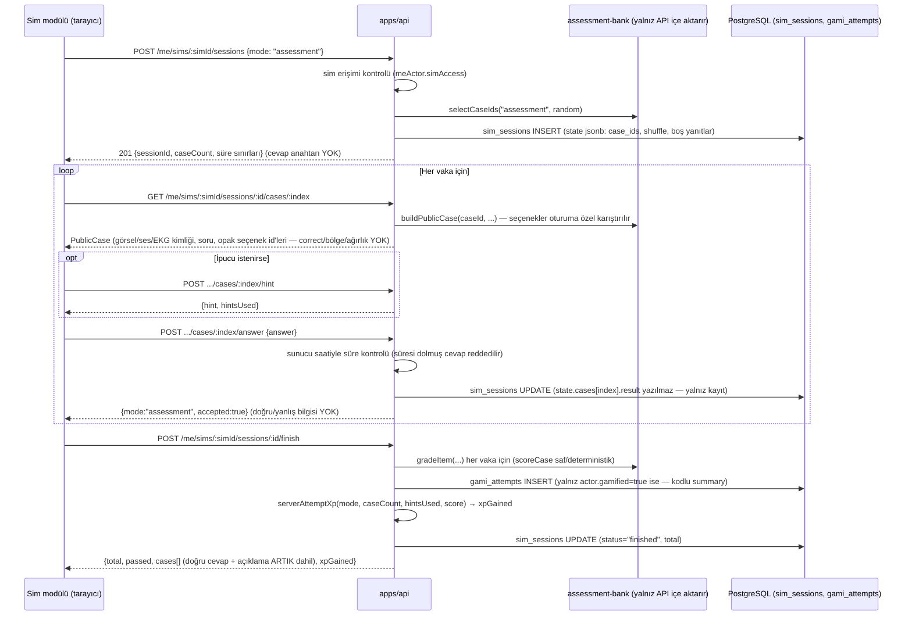
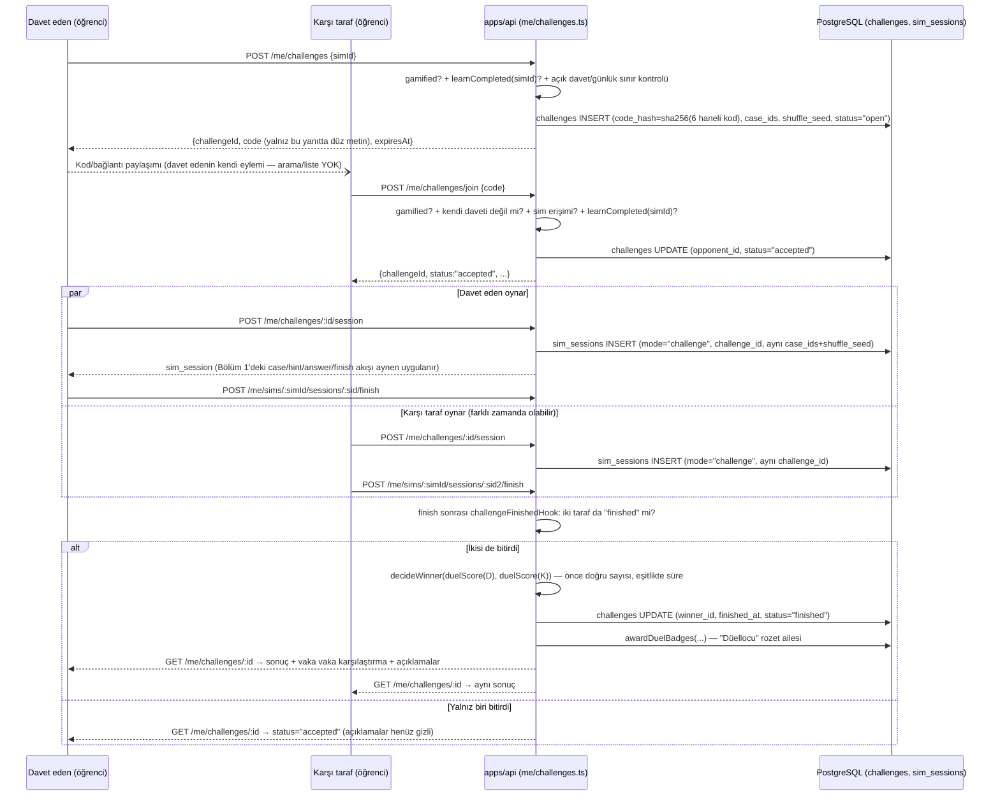
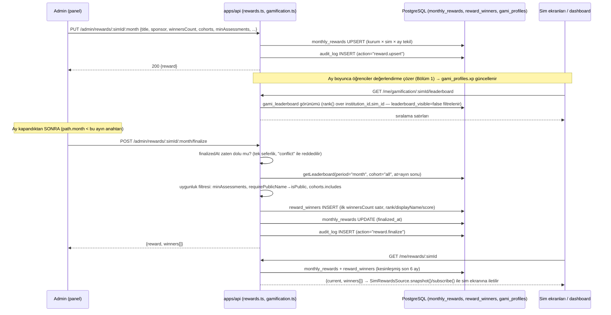
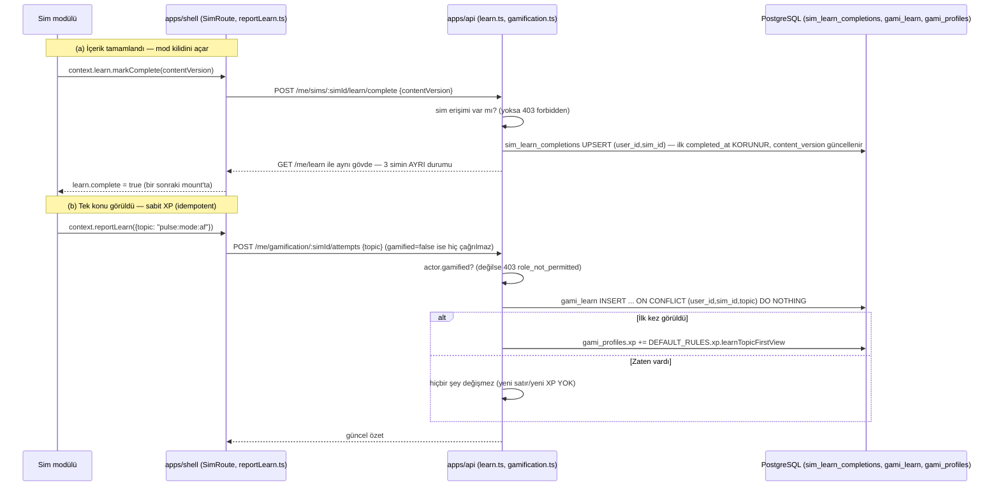
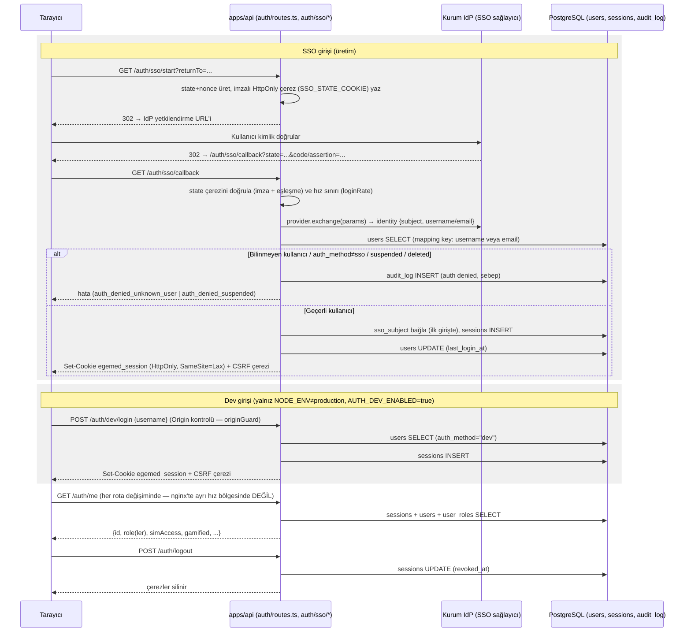

# Temel akışlar (sıra diyagramları)

> Kaynak: `apps/api/src/me/simSessions.ts`, `apps/api/src/me/challenges.ts`,
> `apps/api/src/rewards.ts`, `apps/api/src/me/learn.ts`, `apps/api/src/me/gamification.ts`,
> `apps/api/src/auth/routes.ts`, `apps/api/src/auth/sso/routes.ts`,
> `apps/api/src/auth/sso/flow.ts`, `apps/shell/src/reportLearn.ts`,
> `apps/shell/src/SimRoute.tsx`, `apps/shell/src/session.ts`, ilgili ADR'ler
> (009, 010, 007). T286, 2026-09-30.

## 1. Değerlendirme oturumu (ADR-009)

Cevap anahtarı hiçbir zaman istemciye gönderilmez; puanlama `finish` çağrısında
sunucuda yapılır.

Notlar:
- `POST /me/sims/:simId/sessions` API ucu öğrenme kilidini kontrol ETMEZ
  (bkz. `urun.md` "Önemli bulgu"); yalnız `sim_access` kontrol edilir.
- Uygulama modunda (`practice`) `answer` çağrısı hemen `result` döner
  (anında geri bildirim); değerlendirme (`assessment`) ve düello (`challenge`)
  modlarında sonuç yalnız `finish`te açılır.
- `check` ucu (`POST .../cases/:index/check`) yalnız uygulama modunda tek
  soruyu anında kontrol eder; değerlendirmede kullanılmaz.
- Öğretim üyesi/uzmanlık öğrencisi (`actor.gamified=false`) için `finish`
  puanı hesaplar ama `gami_attempts` satırı YAZILMAZ (deneme kaydı tutulmaz).

## 2. Meydan Okuma düellosu (ADR-010)

Notlar:
- `ogretim_uyesi` ve ziyaretçi düello oluşturamaz/kabul edemez (`actor.gamified`
  kontrolü `role_not_permitted` ile reddeder; ziyaretçi zaten oturumsuzdur).
- Düello puanı normal değerlendirmenin yarısı XP verir ve aylık liderlik/ödüle
  GİRMEZ (`mode="challenge"` ayrı işlenir — bu görevde ayrım noktası koddan
  değil ADR-010 metninden alındı, `gami_attempts.mode` içinde "challenge"
  değeri ayrı sayılır).
- `sim_sessions.challenge_id`'nin DB'de FK kısıtı yoktur (bkz. `veritabani.md`
  Açık sorular); eşleşme uygulama kodundadır.

## 3. Aylık ödül ve liderlik (depo sahibi kararı, 26 Eyl 2026)

Notlar:
- Ödül kurum × sim × ay başınadır; simler arası birleşik ödül yoktur (ADR-006).
- `require_public_name=true` ise yalnız `leaderboard_visible=true` (adla
  görünmeyi seçmiş) öğrenciler kazanan olabilir (`row.isPublic` kontrolü).
- Düello (`challenge`) denemeleri liderlik hesabına girmez (Bölüm 2 notu).

## 4. Öğrenme kaydı ve XP (tek sefer, idempotent)

İki ayrı mekanizma vardır: (a) sim içeriğinin **tamamının** görülmesi (mod
kilidini açar), (b) tek bir **konunun** ilk görülmesi (sabit XP verir).

Notlar:
- `POST /me/gamification/:simId/attempts` eski puanlı deneme ucudur; A4
  (28 Eyl 2026, T226) sonrası yalnız `{topic}` gövdesini kabul eder, puanlı
  gövdeyi `403 server_scored` ile reddeder (ADR-009 güncellemesi).
- Skor, doğru sayısı, süre — hiçbiri bu uca gönderilmez; XP miktarı tamamen
  sunucu sabiti (`DEFAULT_RULES.xp.learnTopicFirstView`), istemci beyan etmez.
- Öğretim üyesi ve uzmanlık öğrencisi bu uca yazamaz (403 `role_not_permitted`);
  öğrenme kilidi zaten onlara istemci tarafında uygulanmıyor (bkz. `urun.md`).

## 5. Giriş: SSO ve (yalnız geliştirmede) dev girişi

Notlar:
- Üretimde `AUTH_DEV_ENABLED=false` sabittir (`docker-compose.prod.yml`);
  `/auth/dev/login` üretimde kapalıdır.
- `/auth/sso/*` uçları yalnız bir SSO adaptörü enjekte edilmişse bağlanır;
  yoksa tüm istekler 404 alır (`registerSsoRoutes` erken çıkış).
- Mutasyon uçları (`POST/PUT/PATCH/DELETE`) double-submit CSRF ister
  (`X-CSRF-Token` başlığı + `egemed_csrf` çerezi eşleşmeli) ve Origin
  başlığını isteğin Host'uyla karşılaştırır.
- SSO state çerezi tek kullanımlıktır; callback'te doğrulanır doğrulanmaz
  silinir. Asıl yeniden-oynatma koruması IdP'nin kod/assertion doğrulamasıdır
  (adaptöre bağlı, bu görev kapsamında adaptör implementasyonu incelenmedi).
