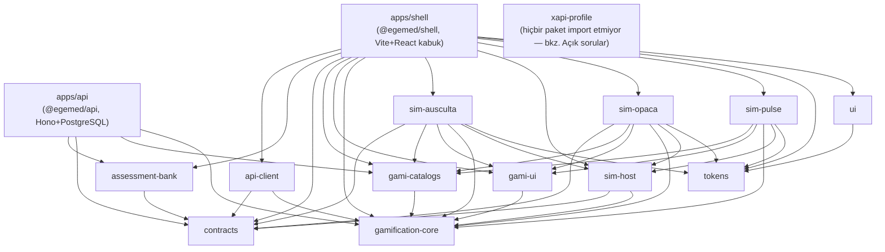
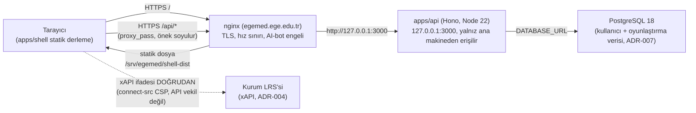

# Mimari

> Kaynak: `apps/shell/package.json`, `apps/api/package.json`,
> `packages/*/package.json` (bağımlılık grafiği), `packages/sim-host/src/SimHost.ts`
> (sim-host sözleşmesi), `infra/prod/nginx-egemed.conf`,
> `infra/prod/docker-compose.prod.yml` (üretim dağıtımı), `docs/adr/*.md`.
> T286, 2026-09-30.

## Paket bağımlılık grafiği

Notlar:
- `assessment-bank` yalnız `apps/api` tarafından içe aktarılır (ADR-009: cevap
  anahtarını taşıyan paket sözleşme testiyle kabuk/sim paketlerinden izole
  edilir — test dosyası bu görev kapsamında okunmadı, kural ADR-009 metninden).
- `sim-pulse`, diğer iki simden farklı olarak `@egemed/contracts`'a doğrudan
  bağımlı DEĞİL (`package.json`'da yok); `SimId` tipini yalnız `sim-host` üzerinden
  dolaylı kullanıyor olabilir — koddan yalnız bağımlılık listesi doğrulandı.
  `sim-ausculta` ve `sim-opaca` ise `contracts`'a doğrudan bağımlı.
  `packages/sim-*/src/data/*.json` okuma sınırı nedeniyle sim içi kullanım
  detayına inilmedi.
  Mermaid diyagramındaki `simPulse --> contracts` oku KASITLI olarak
  çizilmedi (gerçek bağımlılık yok).
- `gamification-core` hiçbir workspace paketine bağımlı değil (yaprak paket);
  `tokens` de öyle.
- `@egemed/ui` yalnız `tokens`'a workspace bağımlılığı taşır; `lucide-react`
  ve `radix-ui` dış bağımlılıklardır.
- `xapi-client` paketi bu depoda YOK (`packages/xapi-client` bulunamadı);
  `AGENTS.md` haritası bu paketten söz ediyor ama worktree'de karşılığı yok
  (bkz. Açık sorular).

## sim-host sözleşmesi (kabuk ↔ sim)

Kaynak: `packages/sim-host/src/SimHost.ts` (ADR-006). Kabuk `createSimHost({load, now, events})`
ile bir host kurar; `host.mount(target, simId, options)` sim modülünü lazy yükler,
`SimMountContext`'i oluşturup `module.mount(target, context)` çağırır. Dönen
`SimDispose` zorunludur; host aynı anda tek oturum tutar (yeni `mount` önce
eskisini kapatır), epoch sayacıyla geç gelen yüklemeleri iptal eder.

| Kanal (`SimMountContext` alanı) | Tip | Amaç |
|---|---|---|
| `simId`, `now`, `actorId?` | zorunlu / opsiyonel temel bağlam | Sim kimliği; zaman `Date.now()` değil enjekte edilir (AGENTS.md); takma kullanıcı kimliği |
| `navigation?` | `SimNavigation` | Derin bağlantı ekranı (`SIM_SCREEN_KEYS`), kabuk geri/ileri ile senkron |
| `setChrome?` | `(chrome: SimChrome \| null) => void` | Birleşik üst bar: adım göstergesi, çipler, eylemler (sim kendi barını çizmez) |
| `gamification?` | `SimGamificationSource` | `summary()` ve `leaderboard()` — API oturumunda sunucudan okur |
| `sessions?` | `SimSessionSource` | ADR-009 sunucu vaka oturumu: `start/getCase/hint/check/answer/finish/audioUrl/imageUrl/startChallenge` |
| `learn?` | `SimLearnPort` | `{ complete, markComplete(contentVersion) }` — öğrenme tamamlama kilidi kanalı |
| `reportLearn?` | `(record: SimLearnRecord) => void` | Puansız konu bazlı öğrenme kaydı (`{ topic }`, A4/ADR-009) |
| `rewards?` | `SimRewardsSource` | `snapshot()` + `subscribe()` — aylık ödül görünümü |
| `audience?` | `SimAudience` (`student\|faculty\|visitor`) | Kitle; yoksa `student` varsayılır |
| `requestSignIn?` | `() => void` | Ziyaretçi kilidindeki "Öğrenci girişi" eylemi |
| `challengeId?`, `onChallengeFinished?` | `string`, `(challengeId) => void` | ADR-010: mount anında doğrudan bu düellonun oturumunu aç; bitince bildir |
| `openChallenges?` | `() => void` | T281a: 4. mod kartı "Meydan Okuma" → kabuk `#/sims/<id>/meydan-okuma` açar (sim barı altında o simin karşılaşma merkezi). Ziyaretçide ve düello modunda verilmez |

**Meydan Okuma merkezi (T281a):** karşılaşma listesi, oluşturma ve kodla katılma ekranı kabukta (`apps/shell/src/challenges/`) doğrudan API ile yürür; simler yalnız `openChallenges()` ile oraya geçer. Kabuk bu rotada sim modülünü mount etmez, aynı sim barını çizer.

## Üretim dağıtımı

Kaynak: `infra/prod/nginx-egemed.conf`, `infra/prod/docker-compose.prod.yml`,
`docs/adr/002-yigin.md`, `docs/adr/004-lrs.md`, `docs/adr/007-kimlik-ve-kullanici-verisi.md`.

Notlar:
- Kabuk statik olarak `/srv/egemed/shell-dist` altında sunulur; `docker-compose.prod.yml`
  kapsamında DEĞİLDİR (yalnız `api` + `postgres` servisleri compose'dadır).
  `nginx-egemed.conf` bu dizini `root` yapar ve SPA fallback (`try_files … /index.html`)
  uygular.
- `/api/` öneki nginx'te soyulur (`rewrite ^/api/(.*)$ /$1 break` — yalnız
  `sso/start|sso/callback|dev/login` location'ında; genel `/api/` bloğunda
  `proxy_pass http://127.0.0.1:3000/` eşdeğer soyma yapar).
  API ağa doğrudan açık değildir (`127.0.0.1:3000:3000`).
- `DATABASE_URL`, `SSO_STATE_SECRET` gibi sırlar yalnız `infra/prod/.env.prod`
  içindedir (repoda yok); compose `${VAR:?zorunlu}` ile eksik değerde sessiz
  kalmadan hata verir.
- Content-Security-Policy'deki `connect-src` `__EGEMED_LRS_ORIGIN__` yer
  tutucusu kurulumda gerçek LRS adresiyle doldurulur (`sed`/`envsubst`);
  ADR-004 kararı gereği tarayıcı xAPI ifadesini DOĞRUDAN LRS'ye gönderir, API
  vekillik etmez (`EGEMED ifade saklamaz`).
- `/sims/` yolu `frame-ancestors 'self'` CSP'si taşır (tarihsel iframe modeli,
  ADR-003); ADR-006 ile sim modülleri artık iframe değil iç modüldür — bu
  location'ın güncel mimariyle ilişkisi netleşmedi (bkz. Açık sorular).
- AI botları (`GPTBot`, `ClaudeBot`, `PerplexityBot` vb.) `robots.txt` ile
  reddedilir ve `$egemed_ai_bot` eşleşmesinde 403 alır (T269 sertleştirmesi).

## ADR referansları

| ADR | Konu | Bu belgeyle ilgisi |
|---|---|---|
| ADR-001 | Monorepo | pnpm workspace `apps/*` + `packages/*`, tek kilit dosyası |
| ADR-002 | Yığın | Vite+React kabuk, Hono+Node 22 API |
| ADR-003 | Simülatör gömme (tarihsel) | ADR-006 ile geçersiz; `/sims/` yol adı ve nginx location'ı kalıntı olabilir |
| ADR-004 | LRS ve xAPI | Tarayıcı→LRS doğrudan bağlantı, EGEMED ifade saklamaz |
| ADR-005 | Kimlik ve öğrenci tanımlayıcısı (tarihsel) | ADR-007 ile kısmen geçersiz |
| ADR-006 | Tek platform (iç modül) | sim-host sözleşmesinin temel gerekçesi |
| ADR-007 | Kimlik, kullanıcı kaydı, oyunlaştırma verisi | `users`/`gami_*` şeması, roller |
| ADR-008 | Rozetler sunucuda | `gami-catalogs`, `gami_badges` |
| ADR-009 | Sunucuda puanlama | `assessment-bank`, `sim_sessions`, sim-host `sessions` kanalı |
| ADR-010 | Meydan Okuma (düello) | `challenges`, sim-host `challengeId`/`onChallengeFinished` |
| ADR-011 | Pulse runtime yetkili kaynağı platform | `packages/sim-pulse/src/runtime/vendor/*` doğrudan düzenlenir |

## Açık sorular

- `packages/xapi-client` bu worktree'de bulunamadı; `AGENTS.md` haritası
  (`packages/sim-opaca, sim-pulse, sim-ausculta … xapi-client, xapi-profile`)
  bu paketten söz ediyor. Kaldırıldı mı, hiç mi oluşturulmadı, yoksa ayrı bir
  worktree/dal'da mı — bu görev kapsamında belirlenemedi.
- `packages/xapi-profile` hiçbir workspace paketinin `package.json`
  bağımlılığında görünmüyor (yalnız kendi `package.json`'ında kendi adı
  geçiyor); kullanımda mı yoksa henüz bağlanmamış bir iskelet mi olduğu
  net değil.
- `infra/prod/nginx-egemed.conf` içindeki `/sims/` location'ı ADR-003'ün
  (iframe gömme) kalıntısı gibi görünüyor; ADR-006 sonrası sim varlıklarının
  gerçekten bu yoldan mı sunulduğu (örn. ses/görüntü dosyaları) yoksa
  location'ın güncellenmeyi mi beklediği bu görev kapsamında doğrulanamadı.
- Geliştirme ortamı dağıtımı (`infra/docker-compose.dev.yml`, `pnpm dev`)
  plan kapsamında "temel alınır" listesine girmediği için bu belgeye
  alınmadı; yalnız üretim (`infra/prod/`) işlendi.
