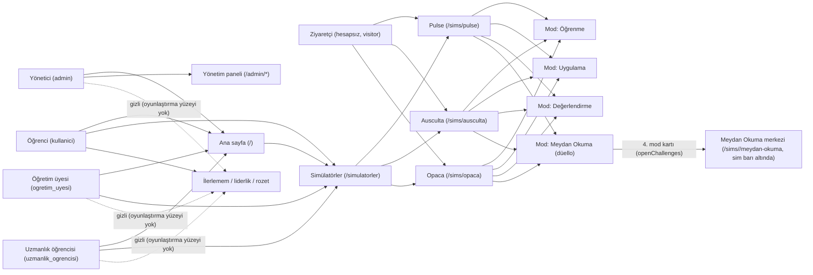
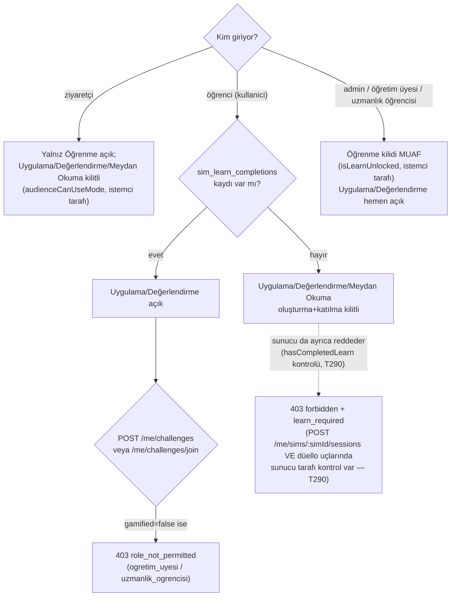

# Ürün şeması

> Kaynak: `packages/contracts/src/ids.ts` (rol/sim kimlikleri),
> `packages/sim-host/src/SimHost.ts` (`SimAudience`, `SIM_SCREEN_KEYS`, mod
> kilidi yardımcıları), `apps/shell/src/routes.ts` (rotalar),
> `apps/shell/src/session.ts` (`isFacultyLike`, `isLearnUnlocked`),
> `apps/api/src/me/challenges.ts` / `simSessions.ts` (sunucu tarafı kilitler).
> T286, 2026-09-30.

## Roller ve yüzeyler

## Mod kilitleri

### Yapay zekâ ajanı uyarısı (T283f)

XP kazandıran rekabetçi ekranlarda (`#/sims/<id>/degerlendirme`, `#/sims/<id>/duello/<uuid>`)
öğrenci kitlesinde kabuk, sayfaya eklenmiş bilinen ajan işaretlerini (`[id^="claude-agent-"]`)
yerel olarak yoklar: işaret görülürse 10 sn kapatma uyarısı, süre dolunca ekran ajan kapanana
dek duraklatılır. Ceza/kayıt yoktur, hiçbir veri gönderilmez (KVKK); sunucu sinyali T283c,
yönetici kararı T283b. `navigator.webdriver` engel sebebi değildir.

### Rekabet engeli (T283b, ADR-009 §6 karar ucu)

Otomatik ceza YOK: T283a'nın işaretlediği (`integrity_flags`, `status="pending"`)
oturumu yalnız yönetici panelden karara bağlar (`POST /admin/integrity/:flagId/decision`,
`cleared`|`confirmed`). `confirmed` kararı kullanıcı başına tek AKTİF engel açar
(`competition_bans`); yönetici `POST /admin/integrity/bans/:userId/lift` ile kaldırır.

Aktif engelli öğrenci için etki yüzeyi — rol: `kullanici` (ve `uzmanlik_ogrencisi`
gamified ise); yüzey → etki:
- Meydan Okuma merkezi (oluşturma/katılma) → 403 `forbidden` + `competition_banned`
  (zaten kabul edilmiş/devam eden düello etkilenmez).
- İlerlemem / liderlik (sim ekranı + ana sayfa vitrini) → listelenmez.
- Aylık ödül kazanan adaylığı → aday olmaz (liderlikle aynı süzgeç).
- Değerlendirme / düello XP'si → 0 (Öğrenme ve Uygulama modları ETKİLENMEZ;
  deneme kaydı ve rozet değerlendirmesi normal yürür).
- `GET /me/gamification` → `data.competitionBanned: true` (istemci göstergesi T283d'de).

İstemci arayüzü (banner, engelli rozeti vb.) T283d kapsamındadır; bu görevde
yalnız sunucu kuralı ve veri alanı vardır.

## Notlar (koddan)

- **Roller** `packages/contracts/src/ids.ts` `ROLES`: `admin`, `kullanici`,
  `ogretim_uyesi`, `uzmanlik_ogrencisi`. Plan metnindeki "öğrenci" = `kullanici`,
  "uzmanlık öğrencisi" = `uzmanlik_ogrencisi`, "öğretim üyesi" = `ogretim_uyesi`,
  "yönetici" = `admin`. "Ziyaretçi" DB rolü değildir; `SimAudience = "visitor"`
  (hesapsız, `apps/shell/src/visitor.ts`, yalnız `sessionStorage` işareti — kişisel
  veri tutulmaz).
- **Oyunlaştırma uygunluğu** (`isGamificationEligible`, `packages/contracts/src/ids.ts`):
  `ogretim_uyesi` ve `uzmanlik_ogrencisi` rozet/XP/liderlik/Meydan Okuma'ya
  katılmaz (`actor.gamified = false`); İlerlemem/liderlik/rozet/Meydan Okuma
  yüzeyleri bu roller ve admin için kabukta gizlenir (`session.ts isFacultyLike`).
- **Öğrenme kilidi muafiyeti** (`apps/shell/src/session.ts isLearnUnlocked`,
  T219, 28 Eyl 2026 depo sahibi kararı): `admin`, `ogretim_uyesi`,
  `uzmanlik_ogrencisi` sime verilen öğrenme portu her zaman "tamamlanmış"
  sayılır (`createUnlockedLearnPort`); yalnız `kullanici` (öğrenci) gerçek
  `sim_learn_completions` kaydına bağlıdır.
- **Kilidin uygulama katmanı (T290, 1 Eki 2026 düzeltildi):** Uygulama/Değerlendirme
  modu için öğrenme kilidi artık hem **istemci tarafında** (`apps/shell`,
  `audienceCanUseMode` / `isLearnUnlocked`) hem **sunucu tarafında** uygulanıyor.
  `POST /me/sims/:simId/sessions` (`apps/api/src/me/simSessions.ts`) `mode`
  `practice`/`assessment` iken `actor.gamified` ise ve aktör admin değilse
  (rol `apps/api/src/auth/repo.ts getMeContext` ile okunur) ilgili simin
  `sim_learn_completions` kaydı yoksa 403 `forbidden` + `learn_required` döner
  (`hasCompletedLearn` / `learnRequiredError`, `apps/api/src/me/learn.ts`) —
  **Meydan Okuma ile aynı ortak yardımcı** (`POST /me/challenges`,
  `POST /me/challenges/join`, `apps/api/src/me/challenges.ts`). Muaf roller
  (admin/`ogretim_uyesi`/`uzmanlik_ogrencisi`) `isLearnUnlocked` ile aynı anlamda
  geçer; `ogretim_uyesi`/`uzmanlik_ogrencisi` zaten `gamified=false` ile muaf,
  admin ayrıca rol kontrolüyle muaf tutulur (`gamified=true` olsa da). Önceki
  sürümde bu uç yalnız `sim_access` kontrol ediyordu; asimetri T290 ile kapatıldı.
- **Ekranlar** (`SIM_SCREEN_KEYS`, `packages/sim-host/src/SimHost.ts`):
  `modlar`, `ogrenme`, `uygulama`, `degerlendirme`, `sonuc`, `ilerlemem`,
  `yardim`, `hakkinda`, `meydan-okuma` — hash alt yoluna yazılır (`#/sims/<id>/<screenKey>`).
- **Rotalar** (`apps/shell/src/routes.ts`): `/` (ana sayfa), `/simulatorler`,
  `/sims/<pulse|ausculta|opaca>` ve `/sims/<id>/meydan-okuma[/<uuid>]` (ana gezinmeye eklenmez, kart
  bağlantılarından açılır; eski `/meydan-okuma[/<uuid>]` adresleri sim içi merkeze yönlendirilir, üst menüde Meydan Okuma yok), `/admin`, `/admin/kullanicilar`, `/admin/ice-aktar`,
  `/admin/roller`, `/admin/denetim`, `/admin/oduller` (yalnız admin oturumuyla,
  ana gezinmede görünmez), `/giris/admin`, `/giris/test-ogrenci` (yalnız
  geliştirme, dev girişi).
- **Üç sim** `pulse`, `ausculta`, `opaca` — `packages/sim-host` `SimulatorId`
  birlik tipi; sim verileri hiçbir yüzeyde birleştirilmez (ADR-006), dashboard
  sim sekmeleriyle ayrı gösterir, simler arası toplam puan yoktur (ADR-007).
