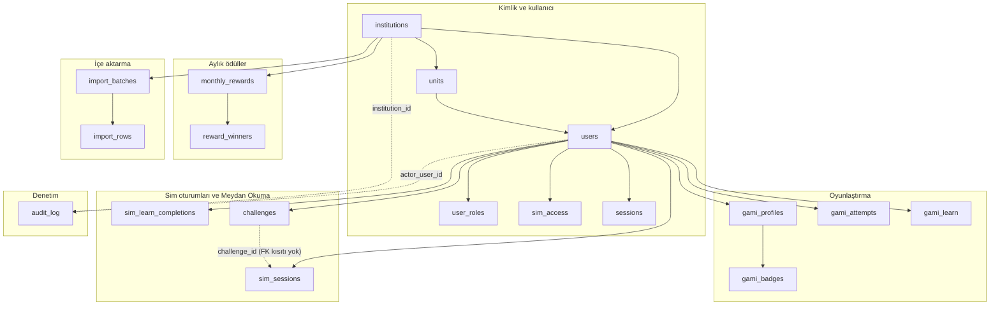
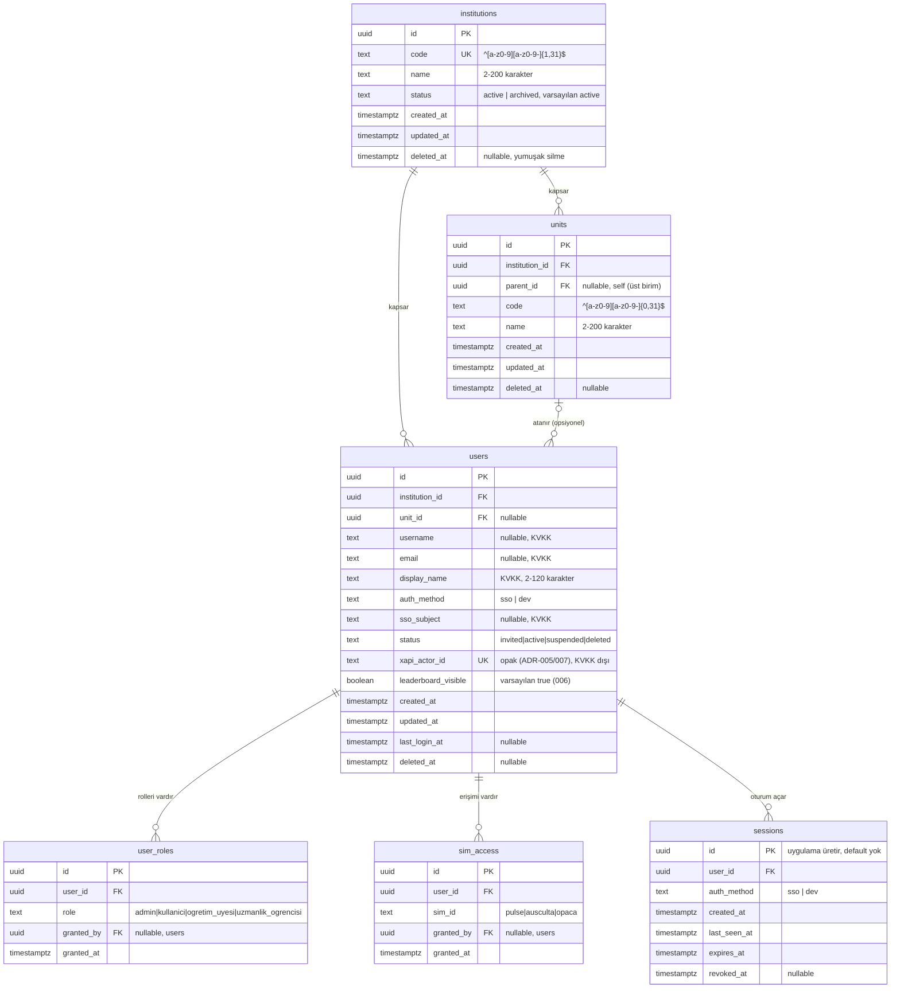
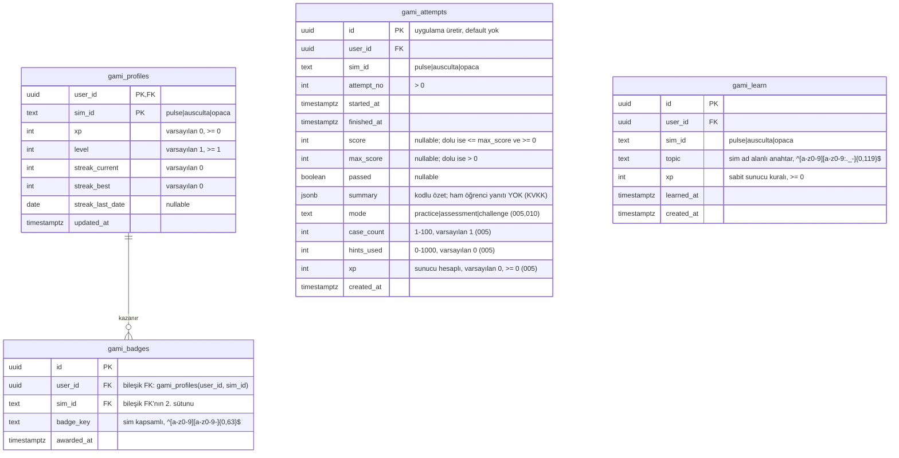
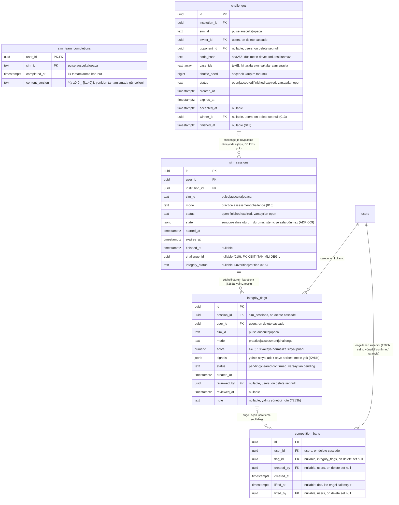
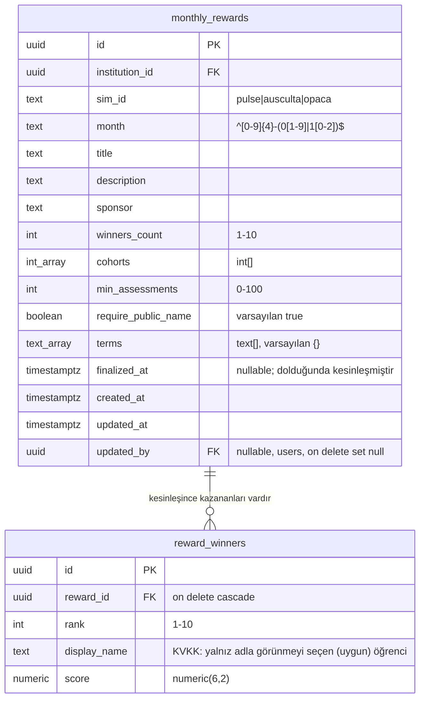
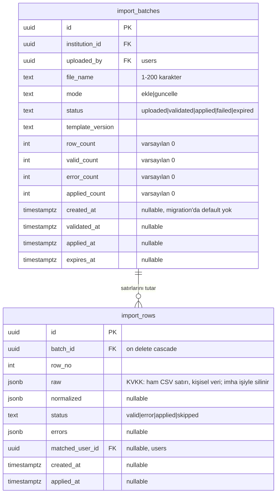
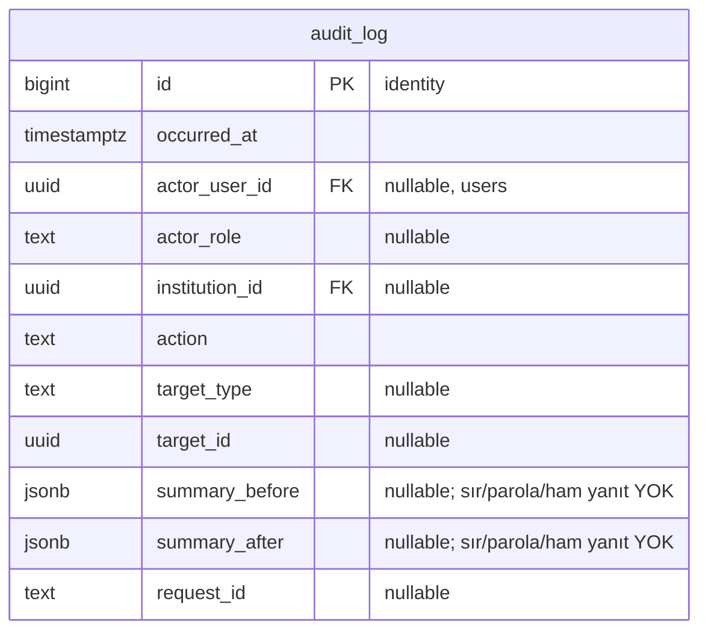

# Veritabanı şeması (ER)

> Kaynak: `apps/api/migrations/001_identity_access.sql` … `014_gami_learn.sql`
> (T286, 2026-09-30). Tablo/sütun adları migration'lardaki gibi İngilizce
> bırakıldı; açıklamalar Türkçe. Kod DEĞİŞMEDİ, bu belge yalnız koddan türetilen
> bir görünümdür — şema değişince bu dosya da güncellenmelidir.

## Okuma notları

- Sütun satırındaki `PK`/`FK`/`UK` Mermaid'in anahtar işaretidir; tırnak
  içindeki metin gerçek PostgreSQL tipini, `CHECK`/varsayılan değeri ve nullable
  durumunu taşır (Mermaid erDiagram tip alanı köşeli parantez veya boşluk kabul
  etmediği için `text_array`/`int_array` gibi güvenli takma adlar kullanıldı;
  gerçek tip yorumda yazılıdır).
- Okunabilirlik için diyagramlarda yalnız **birincil** ilişkiler çizilir
  (varlığı tanımlayan FK'lar: `institution_id`, `user_id`, `batch_id`,
  `reward_id` vb.). "Kim yaptı / kim verdi" türü ikincil `users` FK'ları
  (`granted_by`, `uploaded_by`, `updated_by`, `actor_user_id`, `matched_user_id`,
  `winner_id`) ok olarak çizilmez; sütun listesinde `FK` işaretiyle belirtilir.
- Tablolar 6 alana gruplanmıştır (plan başlıklarından: kimlik/kullanıcı ve
  kurum/birim/rol tek grupta, sim oturumları ve düello tek grupta birleştirildi
  — ilişkileri iç içe geçtiği için ayrı diyagram okunabilirliği düşürüyordu).

## Genel bakış



## 1. Kimlik ve kullanıcı

Kaynak: `001_identity_access.sql`, `006_leaderboard_opt_out.sql` (`users.leaderboard_visible`),
`007_faculty_role.sql` + `012_resident_role.sql` (`user_roles.role` CHECK genişletildi).



Notlar:
- `users_mapping_key_check`: `username` veya `email`'den en az biri dolu olmalı.
- `users_deleted_at_check`: `status = 'deleted'` ise `deleted_at` dolu olmalı.
- Benzersizlik `deleted_at is null` kısmi indeksleriyle yalnız yaşayan satırlara uygulanır
  (yumuşak silinmiş kullanıcı adı/e-postası yeniden kullanılabilir).
- `user_roles.role` CHECK'i sırasıyla `admin,kullanici` (001) → `+ogretim_uyesi` (007)
  → `+uzmanlik_ogrencisi` (012) olarak genişledi; tablo yukarıda son hâliyle gösterildi.

## 2. Oyunlaştırma

Kaynak: `004_gamification.sql`, `005_attempt_server_xp.sql` (mod/case_count/hints_used/xp
kolonları), `010_challenges.sql` (mode CHECK'ine `challenge` eklendi), `014_gami_learn.sql`.



`gami_attempts_user_sim_attempt_key unique(user_id, sim_id, attempt_no)` ve
`gami_learn_user_sim_topic_key unique(user_id, sim_id, topic)` idempotency'yi DB
seviyesinde garanti eder (aynı konu/deneme tekrar XP üretmez).

### Görünüm: `gami_leaderboard` (004, tablo değil)

```sql
select institution_id, sim_id, user_id, xp, level,
       rank() over (partition by institution_id, sim_id order by xp desc, updated_at asc) as rank
from gami_profiles join users on users.id = gami_profiles.user_id
where users.status = 'active' and users.deleted_at is null
```

`users.leaderboard_visible = false` olan kullanıcılar bu görünümde filtrelenmez
(görünürlük API katmanında uygulanır, bkz. `apps/api/src/me/leaderboard.ts` — kod
okuma kapsamı dışında bırakıldı, yalnız migration'daki view koda dayanır).
T295 (1 Eki 2026): API anonimi izleyenin kendisi olsa bile listeye almaz ve özet
sıralamasını görünür satırlar üzerinden yeniden numaralar (boşluksuz).

## 3. Sim oturumları ve Meydan Okuma

Kaynak: `009_sim_sessions.sql`, `010_challenges.sql`, `011_sim_learn_completions.sql`,
`013_duel_results.sql`, `015_integrity_flags.sql`, `016_competition_bans.sql`.



`competition_bans` kullanıcı başına tek AKTİF engel tutar: kısmi benzersiz dizin
`(user_id) where lifted_at is null`. Otomatik ceza YOK — satır yalnız
`POST /admin/integrity/:flagId/decision` (`confirmed`) ile açılır,
`POST /admin/integrity/bans/:userId/lift` ile kapatılır (`lifted_at`/`lifted_by`
dolar, satır silinmez). Etkiler: Meydan Okuma oluşturma/katılma 403
`competition_banned`; liderlik + aylık ödül adaylığından düşme; değerlendirme/
düello XP'si sıfır (öğrenme/uygulama etkilenmez) — bkz. `docs/sema/akislar.md`.

## 4. Aylık ödüller

Kaynak: `008_monthly_rewards.sql`.



`monthly_rewards_institution_sim_month_key unique(institution_id, sim_id, month)`:
kurum × sim × ay başına tek ödül kaydı (ADR ile uyumlu — simler arası ödül yok).

## 5. İçe aktarma

Kaynak: `002_import_staging.sql`.



## 6. Denetim

Kaynak: `003_audit_log.sql`.



`audit_log` append-only'dir: `BEFORE UPDATE OR DELETE OR TRUNCATE` tetikleyicisi
her girişimi `P0010` SQLSTATE'i ile reddeder (uygulama rolünün UPDATE/DELETE
yetkisi olsa bile). İmha işleri (§c, içe aktarma ham satırları) bu tabloyu
etkilemez; istisna tanımlı değildir.

## Tablo amaçları ve KVKK notları

| Tablo | Amaç (1 satır) | KVKK |
|---|---|---|
| `institutions` | Kurum kaydı (şu an tek kurum varsayımı, sınıflandırma amaçlı) | Kişisel veri yok |
| `units` | Kurum içi birim/dönem/grup sınıflandırması | Kişisel veri yok |
| `users` | Platform kullanıcı kaydı; SSO/dev girişin eşleme anahtarı | **Var**: `username`, `email`, `display_name`, `sso_subject` |
| `user_roles` | Kullanıcı↔rol ataması (admin/kullanici/ogretim_uyesi/uzmanlik_ogrencisi) | Yalnız FK (dolaylı) |
| `sim_access` | Kullanıcının erişebildiği sim(ler) | Yalnız FK (dolaylı) |
| `sessions` | Sunucu tarafı oturum (httpOnly çerez karşılığı) | Yalnız FK + zaman damgası |
| `import_batches` | Toplu CSV içe aktarma işi ve sayaçları | Sayaç/özet; kişisel veri yok |
| `import_rows` | İçe aktarmanın ham/normalize satırı, kısa ömürlü | **Var**: `raw` jsonb (ham CSV satırı) |
| `audit_log` | Değiştirilemez (append-only) denetim günlüğü | `actor_user_id` FK; özetler dolaylı kişisel veri taşıyabilir |
| `gami_profiles` | Kullanıcı × sim XP/seviye/seri özeti | Yalnız FK (ad/e-posta yok) |
| `gami_badges` | Kazanılan rozetler (sim kapsamlı anahtar) | Yalnız FK |
| `gami_attempts` | Deneme özeti (kodlu; ham yanıt yok) | `summary` kodlu jsonb; ham yanıt **tutulmaz** |
| `gami_learn` | Puansız öğrenme kaydı (konu başına tek, idempotent XP) | Yalnız FK |
| `gami_leaderboard` (görünüm) | Kurum × sim liderlik sıralaması | Yalnız FK; `leaderboard_visible=false` API'de filtrelenir |
| `sim_sessions` | Sunucu vaka oturumu (seçilen vakalar, yanıtlar) | `state` yalnız kodlu seçenek/ses/görüntü jetonu taşır, serbest metin yok |
| `sim_learn_completions` | "Öğrenme bitti" kilidi kaydı | Yalnız FK |
| `challenges` | Meydan Okuma (düello) daveti ve sonucu | `inviter_id`/`opponent_id`/`winner_id` FK; davet kodu hash'li |
| `monthly_rewards` | Kurum × sim × ay ödül tanımı | Kişisel veri yok |
| `reward_winners` | Kesinleşmiş ay kazananlarının anlık görüntüsü | **Var**: `display_name` (yalnız uygun ve adla görünmeyi seçen öğrenci) |

## Açık sorular

- `sim_sessions.challenge_id` sütununda (migration 010) foreign key kısıtı
  tanımlanmamış; eşleşme yalnız uygulama kodunda (`apps/api/src/me/challenges.ts`)
  kuruluyor. Kasıtlı mı (esneklik) yoksa eksik mi kaldı, migration'dan anlaşılmıyor.
- ADR-010 "Veri" bölümü `challenges` yanında ayrı bir `challenge_participants`
  tablosu öngörüyordu (`challenge_id, user_id, session_id, score, duration_ms,
  finished_at`); gerçek uygulamada bu tablo hiç oluşturulmadı — katılımcı/skor
  bilgisi `sim_sessions.challenge_id` + `sim_sessions.mode='challenge'` ile
  çözülmüş. ADR metni bu noktada güncel değil.
- `import_batches.created_at/validated_at/applied_at/expires_at` `NOT NULL`
  değil ve migration'da varsayılan yok; bu alanların her zaman uygulama
  tarafından dolduruluyor olup olmadığı yalnız migration'dan doğrulanamıyor
  (API kodu okuma kapsamı dışında bırakıldı).
- ADR-007'deki açık insan kararları (SSO protokolü, saklama/imha süreleri,
  ilk admin kaydının oluşturulma yolu) şemaya henüz yansımamış; örn. otomatik
  imha/anonimleştirme işi için ayrı bir iş kuyruğu tablosu yok.
