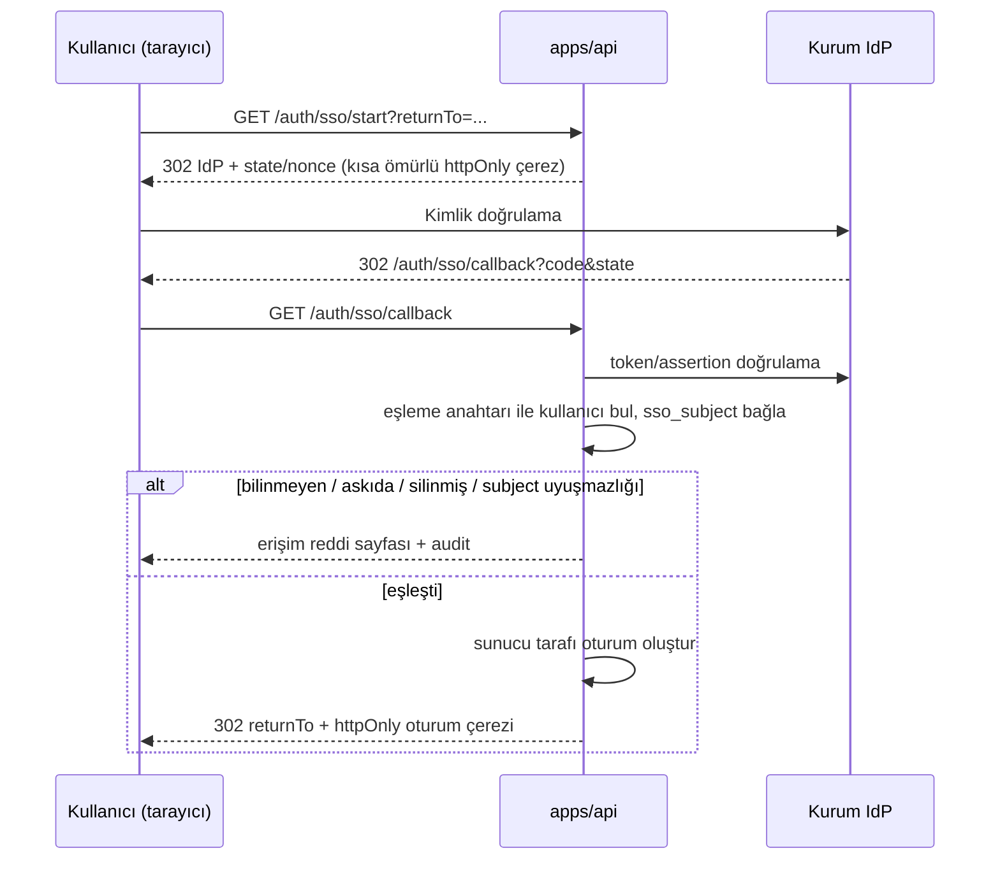
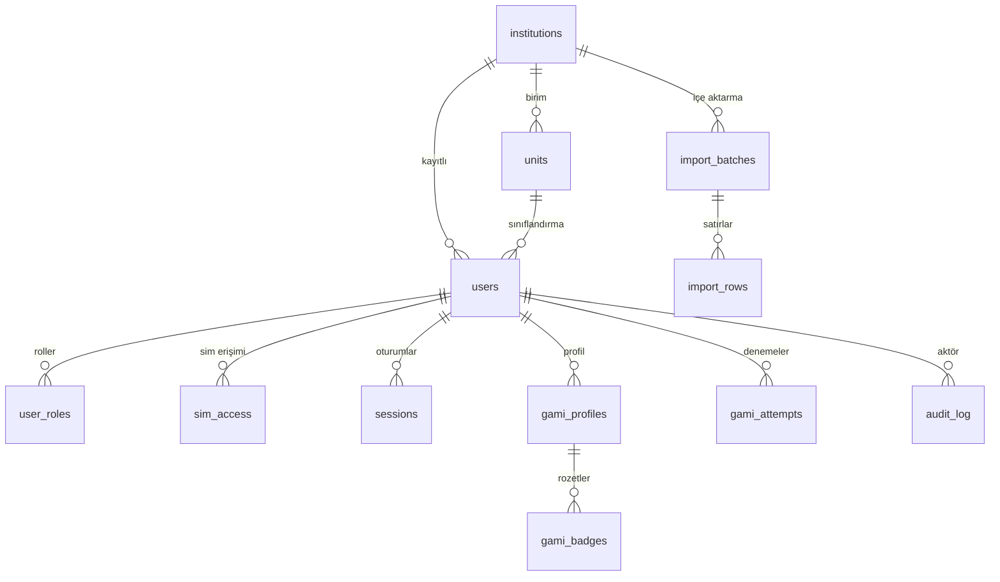

# E3 — Kimlik, kullanıcı yönetimi ve oyunlaştırma verisi tasarımı

Durum: **Tasarım önerisi.** ADR-007 **Önerildi**; "Kabul" insan kararıdır. Bu
belge uygulama yetkisi değildir: ADR-007 kabul edilmeden, E2 K1/K4 kapıları
geçmeden ve §g'deki yeni bağımlılıklar onaylanmadan uygulama görevleri
Running'e alınmaz. İnsan kararları §i'de listelenir.

İlişkili: ADR-002 (yığın), ADR-004 (LRS), ADR-005 (xAPI aktörü), ADR-006 (tek
platform), ADR-007 (kimlik ve kullanıcı verisi), E2 K1/K4,
`packages/xapi-profile`, `infra/docker-compose.dev.yml` (PostgreSQL 18.4).

Kapsam notu: Simülatör verileri birleştirilmez; her oyunlaştırma kaydı tek
`sim_id` taşır. Ders, ödev ve not Moodle'da kalır. xAPI ifadeleri kurum
LRS'sine gider; CLIX ifade saklamaz (ADR-004).

## a. Kimlik akışı

### İlkeler

- CLIX kendi kullanıcı kaydını tutar; kullanıcı **admin tarafından** tek tek
  veya toplu kaydedilir. Kendi kendine kayıt (self-signup) yoktur.
- Üretimde giriş tipi **SSO**'dur (kurum kimlik sağlayıcısı). CLIX parola
  saklamaz, parola sıfırlama akışı sunmaz.
- Tasarım sağlayıcıdan bağımsızdır: SSO protokolü (OIDC / SAML 2.0 / CAS) açık
  insan kararıdır (§i). Akış, protokol adaptörünün arkasında aynıdır.
- Kimlik doğrulama sunucuda yapılır; arayüz yalnız sunumdur.

### `auth_method` ve eşleme anahtarı

| Alan | Değerler | Kural |
|---|---|---|
| `auth_method` | `sso`, `dev` | `sso` üretim; `dev` yalnız geliştirme ortamı. Kullanıcı kaydında seçilir; sonradan değişikliği audit'lenir. |
| Eşleme anahtarı | `username` (kurum kullanıcı adı) veya `email` | En az biri zorunlu; ikisi de olabilir. Kurum içinde benzersiz (büyük/küçük harf duyarsız). E-posta küçük harfe normalize edilir. |
| `sso_subject` | IdP'nin kalıcı kullanıcı kimliği | İlk başarılı SSO girişinde bağlanır. Bir kez bağlandıktan sonra farklı bir `subject` gelirse giriş reddedilir ve audit'lenir (hesap devralma koruması). |

`username`/`email` **xAPI ifadesine girmez**; ifade yalnız opak
`xapi_actor_id` taşır (ADR-005, `packages/xapi-profile`).

### Durum yaşam döngüsü

| Durum | Anlam | Geçişler |
|---|---|---|
| `invited` | Admin kaydetti; ilk giriş bekleniyor. | İlk başarılı giriş → `active`. Askıya alınabilir. |
| `active` | Giriş yapabilir; erişimleri geçerli. | Askıya alınabilir; silinebilir. |
| `suspended` | Giriş reddedilir; mevcut oturumlar iptal edilir. | Etkinleştirilebilir; silinebilir. |
| `deleted` | Yumuşak silme; giriş reddedilir, oturumlar iptal edilir. | Yalnız imha işi (anonimleştirme) işler. |

### SSO giriş akışı



Kurallar:

1. `returnTo` yalnız göreli yol kabul eder (mutlak adres ve şema yasak);
   doğrulama başarısızsa `/`'a döner.
2. Bilinmeyen SSO kullanıcısı → **erişim reddi** (otomatik kayıt yok).
   Askıya alınmış veya silinmiş kullanıcı → **erişim reddi**.
3. İlk girişte `invited` → `active`, `last_login_at` güncellenir.
4. `dev` giriş tipindeki kullanıcı SSO ile, `sso` giriş tipindeki kullanıcı dev
   girişiyle oturum açamaz (sunucu zorlar).
5. Başarısız giriş denemeleri audit'lenir; `/auth/*` için hız sınırı uygulanır
   (eşik insan kararı).

### Oturum

| Özellik | Tasarım |
|---|---|
| Saklama | Sunucu tarafı `sessions` tablosu; ham belirteç yalnız çerezde, DB'de SHA-256 özeti. |
| Çerez | `egemed_session`; `HttpOnly`, `SameSite=Lax`, üretimde `Secure`, `Path=/`, `Domain` yok (host-only). |
| Belirteç | En az 256 bit rastgele; girişte yeni belirteç üretilir (oturum sabitleme koruması). |
| Süre (öneri) | Boşta kalma 30 dk; mutlak üst sınır 12 saat. **İnsan kararı.** |
| İptal | Çıkış, askıya alma, silme ve rol değişiminde ilgili oturumlar iptal edilir. |
| CSRF | Çerez oturumunda tüm mutasyonlar `X-CSRF-Token` (double-submit) + `Origin` kontrolü ister. |
| Günlük | Oturum belirteci, çerez değeri ve kişisel veri loglanmaz. |

### Geliştirme sağlayıcısı (`dev`)

- Yalnız `AUTH_DEV_ENABLED=true` **ve** üretim dışı ortamda etkindir; aksi
  hâlde uç nokta 404 döner.
- Üretim yapılandırmasında `AUTH_DEV_ENABLED=true` görülürse uygulama açılışta
  hata verip durur (kapı testi).
- Sentetik kullanıcılarla çalışır; test öğrencisi girişi (E2 T33b/T33c) bu
  sağlayıcıyı kullanır. Üretim aktörü veya üretim oturumu sayılmaz.

## b. Rol modeli

### Roller

Depo sahibi kararı (23 Eyl 2026): şimdilik **yalnız iki rol** vardır.

| Rol | Kapsam | Özet |
|---|---|---|
| `admin` | Platform | Kullanıcı kaydı, rol atama, sim erişimi, toplu içe aktarma ve toplu düzenleme, denetim günlüğü. Öğrenci oyunlaştırma verisini varsayılan olarak görmez. |
| `kullanici` | Kendisi | Yetkili simler ve kendi oyunlaştırma özeti (sim başına). Admin alanına erişemez. |

Rol kolonu genişlemeye açıktır (yeni rol eklenebilir) ama şema, API ve ekranlar
bugün iki rolle sınırlıdır.

### Yetki matrisi

Bu matris E2'deki özet matrisin yerini alır; K4 insan onayına dek uygulama
yetkisi değildir.

| Yetenek | admin | kullanici |
|---|---|---|
| Kullanıcı listesi görme | Evet | — |
| Kullanıcı oluştur/düzenle | Evet | — |
| Rol ata/geri al | Evet (`admin` yalnız mevcut admin tarafından elle; CSV ile yasak) | — |
| Birim ata (sınıflandırma) | Evet | — |
| Sim erişimi ver/al | Evet | — |
| Toplu içe aktarma | Evet | — |
| Toplu düzenleme | Evet | — |
| Denetim günlüğü görme | Evet | — |
| Kendi oyunlaştırma özeti | — | Evet (sim başına) |
| Admin alanı erişimi | Evet | — |

Kurallar:

1. Etkin yetki, kullanıcının rol satırlarının birleşimidir; `admin` ve
   `kullanici` aynı kullanıcıda birlikte bulunabilir. Rol dışında yetki kapsamı
   yoktur: `institutions`/`units` yalnız sınıflandırma ve filtre amaçlıdır (ör.
   dönem/grup); **tek kurum varsayımı** geçerlidir.
2. `admin` rolü toplu CSV ile atanamaz; yalnız mevcut bir `admin` elle atar; ilk
   `admin` kaydı kurulum tohumuyla oluşturulur (§i).
3. Her mutasyonda rol **sunucuda** yeniden doğrulanır; oturum çerezinde rol
   önbelleği tutulmaz. Rol değişikliği bir sonraki istekte geçerli olur ve
   audit'lenir.
4. Başka kullanıcının kaynağına erişim **404** döner (varlık sızdırma yok);
   yetkisiz eylem **403**'tür.
5. Arayüzde menü/rota gizleme güvenlik sınırı değildir (ADR-002 Astra notu).

### Park edilenler (gelecek genişleme — şemada/API'de/ekranda uygulanmaz)

Depo sahibi kararıyla kapsam iki rolle sınırlandı; aşağıdakiler gelecek
genişleme olarak park edilmiştir:

- Ek roller: `platform_admin`, `kurum_admin`, `egitmen`, `denetci` ve içerik
  yöneticisi.
- Kurum ve birim kapsamlı yetki: `user_roles.scope_unit_id`, birim bazlı
  `sim_access` kayıtları ve "kendi kurumu/birimi" görünürlük kuralları.
- Kurumlar arası izolasyon ve çok kurumlu sıralama; `institutions`/`units`
  yalnız sınıflandırma/filtre amaçlıdır.
- Liderlik tablosunda takma ad ve kurum geneli görünürlük.

## c. Veritabanı şeması (PostgreSQL 18)

Genel kurallar:

- PostgreSQL 18.4 (geliştirme: `infra/docker-compose.dev.yml`); kimlik üretimi
  `gen_random_uuid()`; zamanlar `timestamptz` ve UTC saklanır, gösterim
  Europe/Istanbul.
- Numaralandırmalar `text` + `CHECK` ile tutulur (native enum yerine; migration
  kolaylığı). Kısıt adları açık yazılır.
- Yumuşak silme `deleted_at` iledir; benzersizlik kısıtları kısmi indekslerle
  yalnız yaşayan satırlara uygulanır.
- Hiçbir tablo xAPI ifadesi, parola özeti veya LRS sırrı tutmaz.
- `institutions`/`units` yalnız sınıflandırma ve filtre amaçlıdır (ör.
  dönem/grup); yetki kapsamı değildir ve **tek kurum varsayımı** geçerlidir.
  (İsteğe bağlı) Row Level Security savunma katmanı ayrı migration kararıdır.

### institutions

| Kolon | Tip | Kısıt / açıklama |
|---|---|---|
| `id` | uuid | PK, `default gen_random_uuid()` |
| `code` | text | not null, unique, `^[a-z0-9][a-z0-9-]{1,31}$` |
| `name` | text | not null, 2–200 |
| `status` | text | not null default `'active'`, check in (`active`,`archived`) |
| `created_at` | timestamptz | not null default `now()` |
| `updated_at` | timestamptz | not null default `now()` |
| `deleted_at` | timestamptz | null |

İndeks: `unique (code)`, `(status)`. Not: sınıflandırma amaçlıdır (tek kurum
varsayımı); yetki kapsamı değildir.

### units

| Kolon | Tip | Kısıt / açıklama |
|---|---|---|
| `id` | uuid | PK |
| `institution_id` | uuid | not null, FK → `institutions(id)` on delete restrict |
| `parent_id` | uuid | null, FK → `units(id)` on delete restrict (üst birim) |
| `code` | text | not null, `^[a-z0-9][a-z0-9-]{0,31}$` |
| `name` | text | not null, 2–200 |
| `created_at` / `updated_at` | timestamptz | not null default `now()` |
| `deleted_at` | timestamptz | null |

Kısıt: üst birim aynı kurumda olmalıdır (uygulama kontrolü + test; trigger ayrı
karar). İndeks: `unique (institution_id, code) where deleted_at is null`,
`(institution_id, parent_id)`. Not: sınıflandırma/filtre amaçlıdır (ör.
dönem/grup); yetki kapsamı değildir.

### users

| Kolon | Tip | Kısıt / açıklama |
|---|---|---|
| `id` | uuid | PK |
| `institution_id` | uuid | not null, FK → `institutions(id)` (sınıflandırma) |
| `unit_id` | uuid | null, FK → `units(id)` (sınıflandırma; yetki kapsamı değil) |
| `username` | text | null; eşleme anahtarı 1; `^[a-z0-9][a-z0-9._-]{2,63}$` |
| `email` | text | null; eşleme anahtarı 2; küçük harfe normalize |
| `display_name` | text | not null, 2–120 |
| `auth_method` | text | not null, check in (`sso`,`dev`) |
| `sso_subject` | text | null; ilk girişte bağlanır |
| `status` | text | not null default `'invited'`, check in (`invited`,`active`,`suspended`,`deleted`) |
| `xapi_actor_id` | text | not null, unique; opak; `^[A-Za-z0-9._:-]{8,128}$` (xapi-profile biçimi) |
| `created_at` / `updated_at` | timestamptz | not null default `now()` |
| `last_login_at` | timestamptz | null |
| `deleted_at` | timestamptz | null |

Kısıtlar:

- `check (username is not null or email is not null)`
- `unique (institution_id, lower(username)) where deleted_at is null`
- `unique (institution_id, lower(email)) where deleted_at is null`
- `unique (institution_id, sso_subject) where sso_subject is not null`
- `check (status <> 'deleted' or deleted_at is not null)`

İndeks: `(institution_id, status)`, `(institution_id, unit_id)`,
`(last_login_at)`. Ad araması başlangıçta `ILIKE` ile yapılır; ölçek gerekirse
`pg_trgm` ayrı onaylı görevdir.

### user_roles

| Kolon | Tip | Kısıt / açıklama |
|---|---|---|
| `id` | uuid | PK |
| `user_id` | uuid | not null, FK → `users(id)` on delete cascade |
| `role` | text | not null, check in (`admin`,`kullanici`) |
| `granted_by` | uuid | null, FK → `users(id)` |
| `granted_at` | timestamptz | not null default `now()` |

Kısıt: `unique (user_id, role)`. İndeks: `(user_id)`, `(role)`.
`scope_unit_id` ve kapsam kuralları park edildi (bkz. §b "Park edilenler").

### sim_access

| Kolon | Tip | Kısıt / açıklama |
|---|---|---|
| `id` | uuid | PK |
| `user_id` | uuid | not null, FK → `users(id)` on delete cascade |
| `sim_id` | text | not null, check in (`pulse`,`ausculta`,`opaca`) |
| `granted_by` | uuid | null, FK → `users(id)` |
| `granted_at` | timestamptz | not null default `now()` |

Kısıt: `unique (user_id, sim_id)`. Etkin erişim kişisel kayıttır; birim bazlı
toplu erişim park edildi (§b). Üç simin tümü için erişim verilebilir;
oyunlaştırma üç simde de vardır.

### sessions

| Kolon | Tip | Kısıt / açıklama |
|---|---|---|
| `id` | uuid | PK; oturum belirtecinin SHA-256 özeti |
| `user_id` | uuid | not null, FK → `users(id)` on delete cascade |
| `auth_method` | text | not null, check in (`sso`,`dev`) |
| `created_at` | timestamptz | not null default `now()` |
| `last_seen_at` | timestamptz | not null default `now()` |
| `expires_at` | timestamptz | not null |
| `revoked_at` | timestamptz | null |

İndeks: `(user_id)`, `(expires_at)`. IP ve user-agent saklanmaz (minimizasyon;
gerekirse ayrı insan kararı).

### import_batches

| Kolon | Tip | Kısıt / açıklama |
|---|---|---|
| `id` | uuid | PK |
| `institution_id` | uuid | not null, FK → `institutions(id)` |
| `uploaded_by` | uuid | not null, FK → `users(id)` |
| `file_name` | text | not null, 1–200 |
| `mode` | text | not null, check in (`ekle`,`guncelle`) |
| `status` | text | not null, check in (`uploaded`,`validated`,`applied`,`failed`,`expired`) |
| `template_version` | text | not null |
| `row_count` | int | not null default 0 |
| `valid_count` / `error_count` / `applied_count` | int | not null default 0 |
| `created_at` / `validated_at` / `applied_at` / `expires_at` | timestamptz | null olabilir |

İndeks: `(institution_id, created_at desc)`, `(status, expires_at)`.

### import_rows

| Kolon | Tip | Kısıt / açıklama |
|---|---|---|
| `id` | uuid | PK |
| `batch_id` | uuid | not null, FK → `import_batches(id)` on delete cascade |
| `row_no` | int | not null (1 tabanlı, başlık hariç) |
| `raw` | jsonb | not null; ham CSV satırı — kişisel veri içerebilir, kısa saklanır |
| `normalized` | jsonb | null; doğrulanmış alanlar |
| `status` | text | not null, check in (`valid`,`error`,`applied`,`skipped`) |
| `errors` | jsonb | null; `[{ "column": "...", "code": "...", "message": "..." }]` |
| `matched_user_id` | uuid | null, FK → `users(id)` |
| `created_at` / `applied_at` | timestamptz | null olabilir |

Kısıt: `unique (batch_id, row_no)`. İndeks: `(batch_id, status)`.

### audit_log

| Kolon | Tip | Kısıt / açıklama |
|---|---|---|
| `id` | bigint | PK, `generated always as identity` |
| `occurred_at` | timestamptz | not null default `now()` |
| `actor_user_id` | uuid | null, FK → `users(id)` (sistem işlerinde null) |
| `actor_role` | text | null; eylem anındaki rol |
| `institution_id` | uuid | null, FK → `institutions(id)` |
| `action` | text | not null; ör. `user.create`, `user.suspend`, `role.grant`, `import.apply`, `purge.anonymize` |
| `target_type` | text | null; ör. `user`, `role`, `import_batch` |
| `target_id` | uuid | null |
| `summary_before` / `summary_after` | jsonb | null; yalnız özet — sır, parola, ham yanıt ve ifade yok |
| `request_id` | text | null |

Kısıt: append-only; uygulama rolüne `UPDATE`/`DELETE` yetkisi verilmez.
İndeks: `(institution_id, occurred_at desc)`,
`(target_type, target_id, occurred_at desc)`, `(actor_user_id, occurred_at desc)`.

### gami_profiles

| Kolon | Tip | Kısıt / açıklama |
|---|---|---|
| `user_id` | uuid | not null, FK → `users(id)` on delete cascade |
| `sim_id` | text | not null, check in (`pulse`,`ausculta`,`opaca`) |
| `xp` | int | not null default 0, check `xp >= 0` |
| `level` | int | not null default 1, check `level >= 1` |
| `streak_current` | int | not null default 0 |
| `streak_best` | int | not null default 0 |
| `streak_last_date` | date | null |
| `updated_at` | timestamptz | not null default `now()` |

PK: `(user_id, sim_id)`. İndeks: `(sim_id, xp desc)`.

### gami_badges

| Kolon | Tip | Kısıt / açıklama |
|---|---|---|
| `id` | uuid | PK |
| `user_id` / `sim_id` | uuid / text | not null; bileşik FK → `gami_profiles(user_id, sim_id)` on delete cascade |
| `badge_key` | text | not null, `^[a-z0-9][a-z0-9-]{0,63}$` |
| `awarded_at` | timestamptz | not null default `now()` |

Kısıt: `unique (user_id, sim_id, badge_key)`. `badge_key` **sim kapsamlıdır**;
rozet kataloğu ve hedefler sim başına farklıdır (ortak kurallar, ayrı katalog).

### gami_attempts

| Kolon | Tip | Kısıt / açıklama |
|---|---|---|
| `id` | uuid | PK; istemci üretir, yazma idempotenttir |
| `user_id` | uuid | not null, FK → `users(id)` on delete cascade |
| `sim_id` | text | not null, check in (`pulse`,`ausculta`,`opaca`) |
| `attempt_no` | int | not null, check `attempt_no > 0` |
| `started_at` / `finished_at` | timestamptz | not null |
| `score` / `max_score` | int | null; `score <= max_score` |
| `passed` | boolean | null |
| `summary` | jsonb | not null; **kodlu özet** — ham yanıt yasak (şema testi) |
| `created_at` | timestamptz | not null default `now()` |

Kısıt: `unique (user_id, sim_id, attempt_no)`. İndeks:
`(user_id, sim_id, finished_at desc)`.

### gami_leaderboard (görünüm)

```sql
create view gami_leaderboard as
select
  u.institution_id,
  p.sim_id,
  p.user_id,
  p.xp,
  p.level,
  rank() over (
    partition by u.institution_id, p.sim_id
    order by p.xp desc, p.updated_at asc
  ) as rank
from gami_profiles p
join users u on u.id = p.user_id
where u.status = 'active' and u.deleted_at is null;
```

Not: görünüm ad/takma ad taşımaz; görünen ad kararı API/UI katmanındadır
(§i). Liderlik sim kapsamındadır; tek kurum varsayımıyla kurum ayrımı yalnız
veri sınıflandırmasıdır. Simler arası birleşik sıralama yoktur. Ölçek gerekirse
materialized view ayrı görevdir.

### Yumuşak silme ve imha işi

1. **Silme:** kullanıcı `deleted` + `deleted_at`; oturumlar anında iptal;
   erişim kesilir; audit yazılır.
2. **İmha işi** (zamanlanmış, idempotent, `now` enjekte edilir):
   - süresi geçen oturumları siler;
   - süresi geçen içe aktarma batch'lerinin satırlarını (`import_rows`) siler;
     batch sayaçları ve denetim kaydı kalır;
   - saklama penceresi dolan silinmiş kullanıcıları anonimleştirir:
     `username`/`email`/`sso_subject` null, `display_name` = "Silinmiş
     kullanıcı", `xapi_actor_id` yeni rastgele opak değer, `gami_*` kayıtları
     silinir (veya anonimleştirilir — §i); audit korunur;
   - her adımı `audit_log`'a yazar.
3. **Sert silme** yalnız yasal süre sonunda ve insan kararıyla yapılır;
   varsayılan anonimleştirmedir. Süreler §i'dedir.

### ER diyagramı



## d. API taslağı

Genel kurallar:

- Yollar kök görecedir; dağıtım öneki (ör. `/api`) T62'de sabitlenir.
- Kimlik doğrulama çerez oturumudur; mutasyonlar `X-CSRF-Token` ister.
- Başarılı liste yanıtı `{ "data": [...], "meta": { "page", "pageSize", "total" } }`;
  hata yanıtı `{ "error": { "code", "details?" } }`. Kullanıcıya görünen metin
  `packages/ui/i18n/tr.ts` içinden gelir; sunucu metin değil **kod** döner.
- Her mutasyonda rol sunucuda doğrulanır; başka kullanıcının kaynağına erişim
  404'tür.
- Sır, oturum belirteci ve ham öğrenci yanıtı hiçbir yanıtta dönmez.

### Hata kodları

| HTTP | Kod | Anlam |
|---|---|---|
| 400 | `invalid_request` | Şema/biçim hatası |
| 401 | `unauthorized` / `session_expired` | Oturum yok / süresi doldu |
| 403 | `forbidden` / `role_not_permitted` | Yetki yok |
| 404 | `not_found` | Kaynak yok veya başka kullanıcının kaynağı |
| 409 | `duplicate_mapping_key` / `conflict` / `already_deleted` | Çakışma |
| 422 | `validation_failed` / `import_validation_failed` | Doğrulama hatası |
| 429 | `rate_limited` | Hız sınırı |
| 500 | `internal_error` | Beklenmeyen hata (ayrıntı sızdırılmaz) |

### `/auth/*`

| Yöntem ve yol | Amaç | Yanıt |
|---|---|---|
| `GET /auth/sso/start?returnTo=` | IdP'ye yönlendirir; `state`/`nonce` üretir | 302 IdP; 400 `invalid_request` |
| `GET /auth/sso/callback` | Assertion/token doğrular, kullanıcıyı eşler, oturum açar | 302 `returnTo`; 401 `auth_state_invalid`, `auth_denied_unknown_user`, `auth_denied_suspended`, `auth_subject_mismatch` |
| `POST /auth/logout` | Oturumu iptal eder, çerezi siler | 204 |
| `GET /auth/me` | Oturum sahibinin özeti | 200; 401 |
| `POST /auth/dev/login` | Yalnız geliştirme: sentetik kullanıcıyla oturum açar | 200; kapalıysa 404; 401 |

`GET /auth/me` örnekleri (iki rol):

```json
{
  "data": {
    "id": "00000000-0000-4000-8000-000000000001",
    "displayName": "Örnek Yönetici",
    "roles": [{ "role": "admin" }],
    "institution": { "id": "00000000-0000-4000-8000-000000000010", "name": "Örnek Kurum" },
    "simAccess": ["pulse", "ausculta", "opaca"]
  }
}
```

```json
{
  "data": {
    "id": "00000000-0000-4000-8000-000000000002",
    "displayName": "Örnek Öğrenci",
    "roles": [{ "role": "kullanici" }],
    "institution": { "id": "00000000-0000-4000-8000-000000000010", "name": "Örnek Kurum" },
    "simAccess": ["pulse", "opaca"]
  }
}
```

### `/admin/users`

| Yöntem ve yol | Amaç |
|---|---|
| `GET /admin/users` | Liste; `q`, `role`, `unitId`, `status`, `authMethod`, `sort` (`displayName`,`createdAt`,`lastLoginAt`), `order`, `page`, `pageSize` (en çok 100) |
| `POST /admin/users` | Tek kullanıcı oluşturur |
| `GET /admin/users/:id` | Ayrıntı: roller, birim, sim erişimi, durum geçmişi, son giriş, sim başına oyunlaştırma özeti |
| `PATCH /admin/users/:id` | Görünen ad, birim, eşleme anahtarı (audit'li); `sso_subject` düzenlenemez |
| `POST /admin/users/:id/suspend` | Askıya alır; oturumları iptal eder |
| `POST /admin/users/:id/activate` | Etkinleştirir |
| `DELETE /admin/users/:id` | Yumuşak siler; oturumları iptal eder; 409 `already_deleted` |

Oluşturma isteği (sentetik):

```json
{
  "username": "ornek.ogrenci",
  "email": "ornek.ogrenci@example.invalid",
  "displayName": "Örnek Öğrenci",
  "authMethod": "sso",
  "role": "kullanici",
  "unitId": "00000000-0000-4000-8000-000000000020",
  "simAccess": ["pulse", "opaca"]
}
```

Yanıt 201: `{ "data": { "id": "...", "status": "invited", ... } }`. Kurallar:
`role` yalnız `kullanici` olabilir; `admin` rolü bu uçla atanamaz (403) ve yalnız
mevcut bir `admin` tarafından elle atanır (§b); en az bir eşleme anahtarı
zorunludur (422); kurum içi tekrar 409.

### `/admin/users/bulk`

| Yöntem ve yol | Amaç |
|---|---|
| `POST /admin/users/bulk?dryRun=true` | Seçim + işlem önizlemesi; değişecek/skip sayıları |
| `POST /admin/users/bulk` | Aynı gövdeyi atomik uygular |

Gövde: `{ "userIds": ["..."], "operation": "assign_role" | "revoke_role" |
"set_unit" | "set_status" | "grant_sim" | "revoke_sim", "value": ... }`.
`assign_role`/`revoke_role` yalnız `kullanici` değerini kabul eder; `admin`
403'tür. `set_unit` yalnız sınıflandırmayı (dönem/grup) değiştirir; yetki
kapsamı üretmez.

Kural: herhangi bir satır geçersizse işlem uygulanmaz ve 422 ile satır bazlı
hatalar döner (atomik). Başarılı yanıt: `{ "data": { "updated": 12,
"skipped": [] } }`. Tüm işlem audit'lenir.

### `/admin/imports`

| Yöntem ve yol | Amaç |
|---|---|
| `GET /admin/imports/template` | CSV şablonu indirir (başlık + sentetik örnek satır) |
| `POST /admin/imports` | CSV yükler (`multipart/form-data`); batch `uploaded` |
| `POST /admin/imports/:id/validate` | Ayrıştırır, doğrular; batch `validated`; önizleme döner |
| `GET /admin/imports/:id` | Batch durumu ve sayıları |
| `GET /admin/imports/:id/rows?status=error&page=` | Satır bazlı hata raporu |
| `POST /admin/imports/:id/apply` | Geçerli satırları tek işlemde uygular; idempotent |
| `GET /admin/imports/:id/result` | Sonuç özeti + hatalı satırların CSV'si |

İdempotentlik: `apply` yalnız `valid` ve henüz uygulanmamış satırları işler;
aynı batch için ikinci çağrı `alreadyApplied: true` ve aynı sayılarla döner.
Yükleme sınırları §f'dedir.

### `/admin/roles`, `/admin/audit`, `/me/gamification`, `/me/gamification/:simId`

| Yöntem ve yol | Amaç |
|---|---|
| `GET /admin/roles` | Rol kataloğu (iki rol: `admin`, `kullanici`) ve yetki matrisi (salt okunur; atama kullanıcı uçlarından) |
| `GET /admin/audit` | Denetim günlüğü; `actorId`, `action`, `targetType`, `targetId`, `from`, `to`, sayfalama; salt okunur |
| `GET /me/gamification` | Üç simin **ayrı** özetleri (XP, seviye, seri, haftalık hedef, son rozetler, liderlik özeti); birleştirme yok |
| `GET /me/gamification/:simId` | Kendi özeti: XP, seviye, seri, haftalık hedef, rozetler, liderlik özeti, deneme özetleri |

`GET /me/gamification/pulse` örneği:

```json
{
  "data": {
    "simId": "pulse",
    "xp": 1450,
    "level": 4,
    "streak": { "current": 3, "best": 7, "lastDate": "2026-09-22" },
    "weeklyGoal": { "targetXp": 300, "currentXp": 120 },
    "badges": [{ "key": "ritim-ustasi", "awardedAt": "2026-09-20T10:15:00.000+03:00" }],
    "leaderboard": { "rank": 5, "total": 42 },
    "attempts": [
      { "attemptNo": 2, "finishedAt": "2026-09-22T14:05:00.000+03:00", "score": 80, "maxScore": 100, "passed": true }
    ]
  }
}
```

`GET /me/gamification` yanıtı `{ "data": { "sims": [ … ] } }` biçimindedir; dizi
üç simin ayrı özetini taşır, toplam/türetilmiş tek puan dönmez. Bilinmeyen sim
için 404. Deneme **yazma** ucu aynı sözleşmedendir:
`POST /me/gamification/:simId/attempts` gövdesi yalnız kodlu özet taşır (ham
yanıt yasak); `id` istemci üretir ve yazma idempotenttir. Oyunlaştırma kuralları
(hangi olay XP üretir, hedefler) `gamification-core` kararıdır; bu belge yalnız
veri yolunu tanımlar.

## e. Ekranlar (`@egemed/ui` ile)

Ortak kurallar: tüm metinler `packages/ui/i18n/tr.ts` anahtarlarındandır (yeni
`admin.*` anahtarları UI dilimlerinde eklenir); renkler `@egemed/tokens`;
dokunma hedefi en az 44 px; yatay kaydırma yok; tam klavye gezinmesi; bilgi
yalnız renkle verilmez; odak halkası görünür; `Modal` odak tuzağı kullanılır;
her ekranda boş / yükleniyor / hata / onay durumları vardır.

**Görsel dil (depo sahibi kuralı, 23 Eyl 2026):** tüm ekranlar
`/Users/ozankaraca/Documents/EGEMED CLIX/egemed-sim-ui-ux-framework` bileşen ve
renk kartelasından (`tokens/family-tokens.css` = `packages/tokens/family-tokens.css`)
türetilir; **yeni renk yok**. Referans bileşenler: `components/topbar.html`,
`footer.html`, `dialog.html` (onay diyalogları), `feedback.html`
(başarı/hata/uyarı), `results-summary.html` (sonuç/özet kartları),
`mode-card.html`, `landing.html`; kurallar `docs/01-tasarim-sistemi.md`,
`docs/04-etkilesim-ve-erisilebilirlik.md`. Framework'te birebir karşılığı
olmayan desenler (tablo, filtre, form, sihirbaz) **en yakın bileşenden ve aile
token'larından** türetilir; her ekranın altındaki "Türetildiği framework
bileşeni" satırı bunu yazar.

### 1. Kullanıcılar listesi

```
360 px (kart liste)                     768/1440 px (tablo)
┌──────────────────────────┐            ┌───────────────────────────────────────────────┐
│ Kullanıcılar         [＋]│            │ Kullanıcılar                             [＋]  │
│ [Ara...................] │            │ [Ara......] [Rol▾][Birim▾][Durum▾][Giriş▾]   │
│ [Rol▾] [Durum▾]          │            ├───────────────────────────────────────────────┤
│ ┌──────────────────────┐ │            │ ☐ Ad Soyad   Kullanıcı   Rol   Birim  Durum   │
│ │ ☐ Örnek Öğrenci      │ │            │ ☐ ...                                         │
│ │ Kullanıcı · 3. Sınıf │ │            ├───────────────────────────────────────────────┤
│ │ [Etkin] [SSO]        │ │            │ ‹ 1 2 3 ›                 25/120 kayıt         │
│ └──────────────────────┘ │            └───────────────────────────────────────────────┘
│ [Seçili 2 · Toplu işlem] │
└──────────────────────────┘
```

- Boş: `table.empty` + "Kullanıcı ekle" eylemi. Filtre boş: filtreleri temizle.
- Yükleniyor: iskelet satırlar; hata: kod + "Yeniden dene".
- Seçim çubuğu yapışkan; `aria-live` ile "2 kullanıcı seçildi" duyurulur.
- Klavye: satırlar `Tab` ile odaklanır, `Space` seçer, `Enter` ayrıntıyı açar;
  `Escape` seçimi temizler. Mobilde kart listesi, tabloda yatay kaydırma yok.
- 360/768: filtreler katlanır panel; 1440: tek satır filtre çubuğu.
- Rol filtresi iki değerlidir (`admin`, `kullanici`); birim filtresi
  sınıflandırmadır (dönem/grup).
- Türetildiği framework bileşeni: `mode-card.html` (satır/kart dili),
  `topbar.html` (başlık + araç düğmeleri), `results-summary.html` (liste özeti
  ve boş durum); tablo framework'te yoktur, aile token'larından türetilir:
  `--card`, `--border`, `--r-lg`, `--shadow-card`, `--fs-*`, `--sp-*`.

### 2. Kullanıcı ekle

```
┌──────────────────────────────────────────────┐
│ Yeni kullanıcı                          [×]  │
│ Eşleme anahtarı:  (•) Kullanıcı adı ( ) E-posta
│ [ornek.ogrenci.............................] │
│ Görünen ad:  [Örnek Öğrenci................] │
│ Giriş tipi:  [SSO ▾]  (dev yalnız geliştirme)│
│ Rol:         [Kullanıcı ▾]  (admin elle)     │
│ Birim:       [3. Sınıf ▾]  (sınıflandırma)   │
│ Sim erişimi: ☑ Pulse  ☑ Ausculta  ☑ Opaca    │
│ [!] Kimlik doğrulama SSO ile yapılır; parola │
│     oluşturulmaz.                            │
│                      [Vazgeç] [Kaydet]       │
└──────────────────────────────────────────────┘
```

- Onay: kaydetmeden önce özet diyaloğu (giriş tipi, rol, erişim).
- Hata: alan bazlı `aria-describedby` mesajları; sunucu kodu → Türkçe metin.
- Yükleniyor: kaydet düğmesi meşgul; çift gönderim engellenir.
- Klavye: modal içinde odak tuzağı; ilk odak eşleme anahtarında; `Escape`
  kapatır (kaydedilmemiş değişiklik varsa onay ister).
- Kırılım: 360 px'te tam ekran modal ve tek sütun; 768/1440'ta ortalanmış
  diyalog, alanlar iki sütuna bölünebilir. Yatay kaydırma yok.
- Rol alanında yalnız `kullanici` seçilebilir; `admin` ataması ayrı ve elle
  yapılır (§b).
- Türetildiği framework bileşeni: `dialog.html` (modal, odak tuzağı, onay),
  `feedback.html` (alan/başarı/hata mesajları), `question-card-dark.html`
  (seçim satırı dili); token: `--card`, `--border`, `--r-lg`, `--shadow-pop`,
  `--fs-*`, `--sp-*`.

### 3. Kullanıcı ayrıntı / düzenle

```
┌────────────────────────────────────────────────────────────┐
│ ← Kullanıcılar   Örnek Öğrenci              [Askıya al]    │
│ [Genel] [Roller ve erişim] [Oyunlaştırma] [Geçmiş]         │
├────────────────────────────────────────────────────────────┤
│ Genel: kullanıcı adı, e-posta, görünen ad, birim, giriş    │
│ tipi, durum [Etkin], son giriş (Europe/Istanbul)           │
│ Roller: Kullanıcı                          [Rol ata]       │
│ Erişim: Pulse, Opaca                       [Düzenle]       │
│ Oyunlaştırma (sim başına, birleştirme yok):                │
│   Opaca XP 320 · Seviye 2 · Seri 1                         │
│   Pulse XP 1450 · Seviye 4 · Seri 3                        │
│   Ausculta XP 210 · Seviye 1 · Seri 0                      │
│ Geçmiş: durum/rol değişiklikleri (audit özeti)             │
└────────────────────────────────────────────────────────────┘
```

- Askıya al / etkinleştir / sil: onay diyaloğu; silme "tehlikeli" tonlu ve
  kullanıcı adını yazarak onay ister.
- Boş/yükleniyor/hata durumları sekme bazında; oyunlaştırma verisi yoksa boş
  durum metni.
- Klavye: sekmeler arası ok tuşları; `Tabs` bileşeni kullanılır; 360 px'te
  sekmeler yatay kaydırmaz, alt alta kartlara döner.
- Türetildiği framework bileşeni: `results-summary.html` (özet kutuları),
  `mode-card.html` (sekmeler), `dialog.html` (askıya al/sil onayı),
  `feedback.html` (boş/hata durumu); token: `--card`, `--border`, `--r-lg`,
  `--shadow-card`, `--fs-*`, `--sp-*`.

### 4. Toplu içe aktarma sihirbazı

```
(1 Şablon) ─ (2 Yükle) ─ (3 Eşle) ─ (4 Doğrula) ─ (5 Önizle) ─ (6 Uygula) ─ (7 Sonuç)
┌────────────────────────────────────────────────────────────┐
│ 2. CSV yükle                                               │
│ ┌────────────────────────────────────────────────────────┐ │
│ │  Dosyayı sürükleyin veya seçin                         │ │
│ │  UTF-8, ; ayraç, en çok 2 MB / 5.000 satır             │ │
│ └────────────────────────────────────────────────────────┘ │
│ 4. Doğrulama: 118 geçerli · 6 hatalı        [Hata CSV'si]  │
│ satır 12 · eposta · gecersiz_eposta                        │
│ satır 44 · birim_kodu · bilinmeyen_birim                   │
│                          [Geri] [İleri]                    │
└────────────────────────────────────────────────────────────┘
```

- Adım göstergesi `aria-current` taşır; her adımda boş/yükleniyor/hata durumu.
- Uygula adımı onay diyaloğu ister ("118 kullanıcı oluşturulacak"); sonuç
  ekranı eklenen/güncellenen/hatalı sayıları ve hata CSV'sini verir.
- Klavye: adımlar arası `Tab`; dosya seçimi klavyeyle yapılabilir; sürükle-bırak
  zorunlu değildir.
- Kırılım: 360 px'te tek sütun ve tam ekran adımlar; 768 px'te özet paneli
  yanında; 1440'ta geniş tablo ve hata listesi. Yatay kaydırma yok.
- Türetildiği framework bileşeni: `dialog.html` (adım onayları),
  `feedback.html` (satır hataları), `results-summary.html` (doğrulama/sonuç
  özeti), `landing.html` (adım göstergesinin tek satır düzeni); sihirbaz
  framework'te yoktur, bu bileşenlerden türetilir; token: `--card`, `--border`,
  `--r-lg`, `--shadow-pop`, `--fs-*`, `--sp-*`.

### 5. Toplu düzenleme

```
┌──────────────────────────────────────────────┐
│ Toplu işlem — 12 kullanıcı                   │
│ İşlem:  [Rol ata ▾]                          │
│ Değer:  [Kullanıcı ▾]  (admin yasak)         │
│ Etki: 12 kullanıcı · 0 atlanacak             │
│ [!] Bu işlem denetim günlüğüne yazılır.      │
│                     [Vazgeç] [Uygula]        │
└──────────────────────────────────────────────┘
```

- `dryRun` önizlemesi diyalogda gösterilir; uygulama sonucu satır bazlı liste
  (uygulanan / atlanan / hata) olarak sunulur.
- Onay olmadan mutasyon yok; `Escape` iptal; odak tuzağı.
- Boş seçim / yükleniyor / hata / sonuç durumları; 360 px'te tam ekran
  diyalog, 768/1440'ta ortalanmış diyalog. Yatay kaydırma yok.
- Türetildiği framework bileşeni: `dialog.html` (onay diyaloğu),
  `feedback.html` (satır sonucu), `results-summary.html` (etki özeti); token:
  `--card`, `--border`, `--r-lg`, `--shadow-pop`, `--fs-*`, `--sp-*`.

### 6. Roller ve erişim

```
┌────────────────────────────────────────────────────────────┐
│ Roller ve erişim                                            │
│ ┌───────────────┐ ┌───────────────┐                        │
│ │ Admin         │ │ Kullanıcı     │                        │
│ │ 3 kullanıcı   │ │ 312 kullanıcı │                        │
│ └───────────────┘ └───────────────┘                        │
│ Yetki matrisi (salt okunur tablo, iki rol)                  │
│ Birimler (sınıflandırma): 3. Sınıf ▸ Grup A                 │
│ Sim erişimi: kişi bazlı kayıtlar listelenir                 │
└────────────────────────────────────────────────────────────┘
```

- Rol ataması bu ekrandan yapılmaz; kullanıcı ayrıntısına bağlantı verilir
  (tek yol ilkesi). `admin` ataması yalnız mevcut admin tarafından elle yapılır.
- `kullanici` rolünde admin alanı rotaları görünmez; erişim yine sunucuda
  reddedilir.
- Birim bazlı toplu sim erişimi park edildi (§b); birim yalnız sınıflandırmadır.
- Onay durumu yoktur (mutasyon yok); boş/yükleniyor/hata durumları vardır.
- Kırılım: 360 px'te rol kartları ve matris alt alta; 768/1440'ta yan yana. Matris
  dar ekranda yatay kaydırmaz, satır bazlı karta döner.
- Türetildiği framework bileşeni: `mode-card.html` (rol kartları),
  `results-summary.html` (sayı kutuları), `feedback.html` (boş durum); token:
  `--card`, `--border`, `--r-lg`, `--shadow-card`, `--fs-*`, `--sp-*`.

### 7. Denetim günlüğü

```
┌────────────────────────────────────────────────────────────┐
│ Denetim günlüğü                                             │
│ [Aktör....] [Eylem▾] [Hedef....] [Başlangıç] [Bitiş]        │
├────────────────────────────────────────────────────────────┤
│ 23.09.2026 14:05  Örnek Yönetici  user.suspend  Örnek Öğr.  │
│ 23.09.2026 13:40  Sistem          purge.run     —           │
├────────────────────────────────────────────────────────────┤
│ ‹ 1 2 ›                                                     │
└────────────────────────────────────────────────────────────┘
```

- Zamanlar Europe/Istanbul; satır ayrıntısı modalda `summary_before/after`
  özetini gösterir; sır, oturum belirteci ve ham veri gösterilmez.
- Salt okunur; onay durumu yoktur; boş/yükleniyor/hata durumları vardır.
- Kırılım: 360 px'te kart liste, 768 px'te sadeleştirilmiş tablo, 1440'ta tam
  tablo; yatay kaydırma yok.
- Türetildiği framework bileşeni: `mode-card.html` (satır/kart dili),
  `dialog.html` (satır ayrıntısı), `topbar.html` (filtre çubuğu düzeni); token:
  `--card`, `--border`, `--r-lg`, `--shadow-card`, `--fs-*`, `--sp-*`.

### 8. Kullanıcı dashboard'u (öğrenci ana sayfası)

```
360 px (tek sütun)                        768/1440 px
┌──────────────────────────────┐          ┌─────────────────────────────────────────────┐
│ EGEMED CLIX           [☰]    │          │ EGEMED CLIX                    [Örnek Öğr.] │
│ [Opaca][Pulse][Ausculta]     │          │ [Opaca] [Pulse] [Ausculta]                  │
│ ┌──────────────────────────┐ │          │ ┌───────────────────┐ ┌───────────────────┐ │
│ │ XP 1450                  │ │          │ │ XP 1450           │ │ Seviye 4          │ │
│ │ Seviye 4 · Seri 3 (7)    │ │          │ └───────────────────┘ └───────────────────┘ │
│ │ Haftalık hedef 120/300   │ │          │ ┌───────────────────┐ ┌───────────────────┐ │
│ │ Son rozetler: …          │ │          │ │ Seri 3 (en iyi 7) │ │ Haftalık 120/300  │ │
│ │ Liderlik (Pulse): 5/42   │ │          │ └───────────────────┘ └───────────────────┘ │
│ └──────────────────────────┘ │          │ Son rozetler: …                             │
└──────────────────────────────┘          │ Liderlik (Pulse): 5/42                      │
                                          └─────────────────────────────────────────────┘
```

- Sim sekmeleri (Opaca | Pulse | Ausculta) her sekmede **yalnız o simin** verisini
  gösterir: XP, seviye, seri, haftalık hedef, son rozetler ve sim liderlik özeti
  (sıra/toplam). **Simler arası toplam puan yoktur** (ADR-006/007 izolasyonu).
- Veri kaynağı `GET /me/gamification` (üç ayrı özet) veya sekme başına
  `GET /me/gamification/:simId`; birleştirme istemcide de yapılmaz.
- Erişimi olmayan sim sekmesi görünmez veya pasif gösterilir ve nedeni yazılır
  (`sim_access`).
- Boş durum: o simde kayıt yoksa "Henüz ilerleme yok — simülatöre başla" ve sim
  rotasına bağlantı; yükleniyor iskelet; hata kod + "Yeniden dene".
- Klavye: sekmeler `role="tablist"` + ok tuşları (`Tabs` bileşeni); odak halkası
  görünür; 360 px'te sekmeler yatay kaydırmaz, kartlar alt alta iner.
- Türetildiği framework bileşeni: `results-summary.html` (özet kutuları),
  `mode-card.html` (sekme/kart dili), `topbar.html` + `footer.html` (kabuk),
  `feedback.html` (boş/hata durumu); token: `--card`, `--border`, `--r-lg`,
  `--shadow-card`, `--fs-*`, `--sp-*`; yeni renk yok.

## f. CSV şablonu

Biçim: UTF-8 (Excel uyumu için BOM önerilir), ayraç `;`, RFC 4180 tırnaklama,
ilk satır başlık. Türkçe karakterler değerlerde serbesttir; anahtar alanlar
ASCII'dir.

| Kolon | Zorunlu | Doğrulama |
|---|---|---|
| `kullanici_adi` | Koşullu (e-posta yoksa) | 3–64, `^[a-z0-9][a-z0-9._-]{2,63}$`, kurum içinde benzersiz |
| `eposta` | Koşullu (kullanıcı adı yoksa) | Geçerli e-posta, küçük harfe normalize, kurum içinde benzersiz |
| `ad_soyad` | Evet | 2–120, boş olamaz |
| `rol` | Hayır (varsayılan `kullanici`) | Yalnız `kullanici`; `admin` yasak (satır hatası) |
| `birim_kodu` | Hayır | Sınıflandırma (dönem/grup); kurumda tanımlı olmalı; yetki kapsamı değildir |
| `sim_erisimi` | Hayır | Virgülle `pulse,ausculta,opaca`; boş = erişim yok |
| `giris_tipi` | Hayır (varsayılan `sso`) | `sso` veya `dev`; `dev` yalnız geliştirmede kabul |

Doğrulama ve sınırlar:

- Aynı dosyada tekrar eden eşleme anahtarı: iki satır da hatalı.
- Veritabanında mevcut anahtar: `ekle` modunda hata, `guncelle` modunda
  güncelleme (görünen ad, rol, birim, sim erişimi). `admin` değeri hiçbir modda
  kabul edilmez; yalnız mevcut admin elle atar (§b).
- Bilinmeyen birim/rol, geçersiz e-posta, iki anahtarın da boş olması, alan
  uzunluğu ihlali: satır hatası.
- En fazla 5.000 satır ve 2 MB; başlık eşleşmesi zorunlu; boş satırlar atlanır.
- Hata raporu CSV'si: `satir_no;kolon;kod;aciklama` (yalnız sentetik örnek
  veriyle test edilir).
- `apply` idempotenttir; aynı dosyanın yeniden yüklenmesi yeni batch açar,
  mevcut kullanıcılar moda göre hata veya güncelleme olur.

## g. Teknoloji önerisi

ADR-002 yığını esastır: **Hono + Node 22** (kabul edildi), **PostgreSQL 18**.
Aşağıdaki her yeni paket **"insan onayı bekliyor"** durumundadır; alternatifleri
listelenmiştir. Onaysız bağımlılık eklenmez (AGENTS.md).

| Bileşen | Öneri | Alternatifler | Durum |
|---|---|---|---|
| Sunucu çatısı | Hono (ADR-002) | Fastify, çerçevesiz `http` | ADR-002 ile kabul; paket kurulumu T62 |
| PostgreSQL istemcisi | `pg` (node-postgres) + elle SQL | `postgres` (postgres.js), ORM | **İnsan onayı bekliyor** |
| Migration | `node-pg-migrate` (düz SQL, up/down) | `graphile-migrate`, drizzle-kit, elle runner | **İnsan onayı bekliyor** |
| SSO (protokol kararına bağlı) | OIDC: `openid-client`; SAML: `@node-saml/node-saml`; CAS: ayrı değerlendirme | Elle protokol uygulaması (önerilmez) | **İnsan onayı bekliyor**; protokol §i |
| Oturum/çerez | Hono `hono/cookie` + Node `crypto` | Elle çerez yönetimi | Hono ile gelir; ek bağımlılık yok |
| CSRF | Double-submit + `Origin` kontrolü (Hono `csrf` yardımcıları) | Yalnız SameSite | Ek bağımlılık yok |
| Doğrulama | `packages/contracts` tipleri + elle tip korumaları | `zod`, `valibot` | **İnsan onayı bekliyor** (zod önerilirse) |
| CSV ayrıştırma | Elle RFC 4180 ayrıştırıcı (küçük yüzey) | `csv-parse`, `papaparse` | **İnsan onayı bekliyor** |
| Test | Mevcut Vitest; API için Hono `app.request()` | — | Mevcut |
| DB entegrasyon testi | CI servis konteyneri + yerel `pnpm infra:up` | `testcontainers`, `pg-mem` | **İnsan onayı bekliyor** (testcontainers) |
| Parola | Yok — parola saklanmaz | argon2/bcrypt | Karar gereği yok |
| Gözlemlenebilirlik | Yapılandırılmış log + `request_id`; kişisel veri loglanmaz | Ek APM aracı | **İnsan onayı bekliyor** (APM) |

Not: `pg_trgm` uzantısı yalnız arama ölçeklenirse ayrı onaylı görevdir.

## h. Uygulama dilimleri

Kurallar: her dilim tek paket/uygulama ve yaklaşık 400 satır diff hedefler; aynı
pakette eşzamanlı Running açılmaz; sözleşme (T60) tüketicilerinden önce merge
edilir; her dilimde `pnpm turbo lint typecheck test`.

Numaralar T60'tan başlar; T38…T52 aralığı başka bir iş hattında (premium kabuk
T38a/b) kullanıldığı için bu belge T60…T75 kullanır.

| Görev | Paket | İçerik | Bağımlılık | Karar kapısı |
|---|---|---|---|---|
| T60 | `packages/contracts` | Kimlik/kullanıcı/rol/import/oyunlaştırma tipleri, hata kodları, CSV şeması | — | ADR-007 kabul; Astra ikinci görüşü (sözleşme) |
| T61 | `apps/api` | PostgreSQL migration seti (§c) + imha fonksiyonları | T60 | ADR-007 kabul; saklama süreleri §i |
| T62 | `apps/api` | Hono iskeleti, ortam doğrulama, hata modeli, `request_id`, DB havuzu | T60, T61 | Yeni bağımlılık onayı (§g) |
| T63 | `apps/api` | Oturum çekirdeği, dev sağlayıcı, `/auth/me`, `/auth/logout` | T62 | K1; T33c bağlanır |
| T64 | `apps/api` | SSO adaptörü + seçilen protokol + `/auth/sso/start` ve `/auth/sso/callback` | T63 | SSO protokolü §i |
| T65 | `apps/api` | `/admin/users` CRUD + askıya al/etkinleştir/sil + audit | T63 | K4 yetki matrisi |
| T66a | `apps/api` | `/admin/users/bulk` (dryRun + atomik) | T65 | K4 |
| T66b | `apps/api` | `/admin/imports` (yükle/doğrula/önizle/uygula, hata raporu) | T65 | CSV sınırları §f |
| T67 | `apps/api` | `/admin/audit` + denetim sertleştirme | T65 | Denetim saklama §i |
| T68 | `apps/api` | `/me/gamification` + `/me/gamification/:simId` okuma + deneme yazma | T60 | Oyunlaştırma kuralları `gamification-core` kararı |
| T69 | `apps/shell` | Kullanıcı listesi (arama/filtre/seçim/sayfalama/mobil kart) | T26, T65 | K4; E2 T27 |
| T70 | `apps/shell` | Kullanıcı ekle + ayrıntı/düzenle | T69 | E2 T27 |
| T71 | `apps/shell` | Roller/erişim + toplu düzenleme | T70 | E2 T27, T28 |
| T72 | `apps/shell` | Toplu içe aktarma sihirbazı | T66b, T69 | E2 T27 |
| T73 | `apps/shell` | Denetim günlüğü ekranı | T67, T26 | E2 T31 |
| T74 | `apps/shell` | Kullanıcı dashboard'u (sim sekmeleri; §e.8) | T68, T26 | K1; ADR-006 izolasyonu |
| T75 | `tests` | Admin kimlik e2e: giriş reddi, rol sınırı, toplu işlem | T69–T74 | E2 T09 |

Not: T26 (admin kabuğu) ve T33c (giriş bağlama) E2'de planlıdır; bu tablo
onların içeriğini besler. SSO hazır olana dek T33c dev sağlayıcı ile çalışır;
üretim iddiası taşımaz.

## i. Açık kararlar (insan)

1. **SSO protokolü ve kurum IdP bilgisi:** OIDC / SAML 2.0 / CAS; metadata,
   öznitelik eşlemesi, tek çıkış (SLO) desteği.
2. **Saklama ve imha süreleri:** oturum boşta/mutlak süre, içe aktarma staging,
   denetim günlüğü, silinen kullanıcı penceresi, oyunlaştırma kayıtları.
3. **Öğrencinin silme hakkı:** kendi oyunlaştırma verisini silme talebi ve
   kapsamı (yalnız özet mi, tüm denemeler mi).
4. **Liderlik tablosu:** görünen ad mı, takma ad mı; öğrenciye açık mı, yalnız
   admin mi.
5. **İlk `admin`:** kurulum tohumu ve acil erişim (break-glass) yolu.
6. **KVKK rolü:** veri sorumlusu / veri işleyen; aydınlatma metninin sahibi ve
   hukuki dayanak (hukuk görüşü).
7. **Oturum süreleri ve hız sınırı eşikleri.**
8. **CSV sınırları:** 5.000 satır / 2 MB önerisi ve `ekle`/`guncelle` modları.
9. **Oyunlaştırma kuralları:** XP/seviye/seri/rozet üretimi ve sim başına
   hedefler `gamification-core` kararıdır; bu belge yalnız veri yolunu tanımlar.

Not: Park edilen roller ve kurum/birim kapsamlı yetki (§b) bu listede karar
maddesi değildir; kapsam dışıdır.
